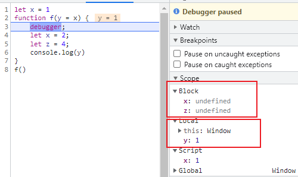
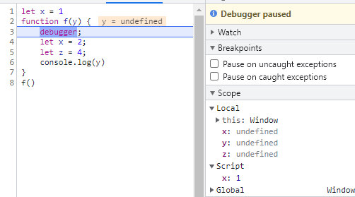

# ES6相关面试题

## var、let、const之间的区别？

### var：

1.var可以重复多次声明同一个变量；

2.var声明的变量在编译阶段会进行变量提升;

```js
console.log(a) // undefined
var a = 5

// 上面代码在执行过程等价于
var a
console.log(a)
a = 5
```

3.var不受块级作用域影响，但会受到函数作用域限制;

```js
{
    var a = 10
}

console.log(a) // 10

var a = 20
function change(){
    var a = 30
}
change()
console.log(a) // 20，函数作用域的a不会影响外部的a变量
```

### let：

1.let不能在同一个作用域中重复声明变量；

```js
let a = 20
let a = 30 // 报错
```

2.let受到块级作用域影响；

```js
{
    let a = 10
}
console.log(a) // a is not defined
```

如果在一个块级作用域内使用了let声明变量，那么这个变量就不受外部影响，使用let声明变量之前，这个变量都不可用，也就是我们俗称的'暂时性死区'

```js
var a = 123
if(true) {
    a = 'abc' // ReferenceError: Cannot access 'a' before initialization
    let a;
}
```

3.编译阶段不会变量提升。

```js
console.log(a) // a is not defined
let a = 10
```

### const：

1.const用来声明一个只读常量，首次声明时必须赋值，且之后无法重新再赋值；

```js
const a = 10
const a = 20 // SyntaxError: Identifier 'a' has already been declared

// 变量使用var let声明过，也不能用const重复声明
var b = 10
const b = 20 // SyntaxError: Identifier 'a' has already been declared
```

实际上，const无法修改的是初始化后内存的地址值所存储的数据，但是对于引用值来说，const声明的变量，在对应的内存地址中保存的不是值，而是另一个地址(或者说指针)，const只能保证初始化时地址不变，不能保证引用值不变。

```js
const obj = {}
obj = 3 // 不允许

obj.a = 3 // 允许
console.log(obj) // {a:3}
```

三者间区别：

1.变量提升（var有，let、const没有）；

2.暂时性死区（var没有，let、const有）；

3.块级作用域（var没有，let、const有）；

4.重复声明（var可以，let、const不行）；

5.修改声明过的变量值（var、let可以，const不行）。

## ES6中数组拓展

### 1.拓展、收集运算符

```js
// 1.把数组展开成参数序列
console.log(...[1,2,3])
// 等价于
console.log(1,2,3)

// 2.把类数组、可迭代对象(包括set、map)转换成数组
let s = new Set()
s.add(1)
s.add(2)
console.log(s) // Set {1,3}
[...s] // [1, 3]

// 3.数组复制
const a1 = [1,2]
const [...a2] = a1 // a2 = [1,2]

// 4.配合解构赋值（收集运算符一定要放到最后面）
const [first, ...rest] = [1,2,3,4,5,6]
first = 1
rest = [2,3,4,5,6]
```

### 2.构造函数新增方法

1.Array.from

接受一个类数组对象、可迭代对象，把他们转换成真正的数组对象。

```js
// 第二个参数是一个回调函数，对每个元素进行处理，类似于map方法
Array.from([1, 2, 3], (x) => x * x)
```

2.Array.of

接受一个参数列表，把这个参数列表转换成数组

```js
Array.of(1,2,3) // [1,2,3]
```

### 3.实例对象上的方法

1.fill(value, start, end)

```js
// 用value填充数组
[1,2,3].fill(0) // [0,0,0]
```

2.find, findIndex

```js
// find找元素并返回该元素，findIndex找元素并返回元素所在数组的索引
[1,2,3].find((value) => (value === 2)) // 2
[1,2,3].findIndex((value) => (value === 2)) // 1
```

3.includes

```js
// 查找数组元素，找到返回true，找不到返回false
[4,5,6].includes(5) // true
[4,5,6].includes(7) // false
```

4.copyWithin(target, start, end)

```js
// 浅复制数组的一部分到同一数组的另一位置，并返回该数组，不改变数组长度
[1,2,3,4,5].copyWithin(0,2,4) // [3,4,3,4,5]
```

5.flat(depth) flatMap(callBack, [thisArg])

```js
// flat：根据指定深度递归地把所有子数组拼接到一个新数组中
[1,2,[5,5,5]].flat(1) // [1,2,5,5,5]
[1,[2,2,[3,3,3]]].flat(2) // [1,2,2,3,3,3]

// flatMap:对数组中每个元素调用回调函数，并把结果展开成一维数组；等价于先调用map()再调用flat(1)。
[1,2,4,5,5].flatMap(val => val**2) // [1,4,16,25,25]
```

6.keys values entries，数组调用这三个方法都会返回一个迭代器，可以用来对数组进行遍历

```js
const obj = {
	a:1,
    b:2,
    c:3
}
// keys是对键名的遍历
for (let index of ['a', 'b'].keys()) {
  console.log(index);
}
// 0
// 1

// values是对键值的遍历
for (let elem of ['a', 'b'].values()) {
  console.log(elem);
}
// 'a'
// 'b'

// entries对键值对的遍历
for (let [index, elem] of ['a', 'b'].entries()) {
  console.log(index, elem);
}
// 0 'a'
// 1 'b'
```

### 4.数组的空位

es6之后，数组的空位默认均为undefined (不会像es5的时候允许[empty, empty]数组形式存在)。

## ES6中对象的拓展

### 1.属性简写

```js
// 1.对象键名和对象值相等时，可以简写
const obj = {
    foo: foo
}

// 等价于
const obj = {
    foo
}

// 2.函数方法也可以简写
const obj = {
    find: function() {}
}

// 等价于
const obj = {
    find() {}
}

// 注意：简写的对象方法不能用作构造函数，否则会报错
const obj = {
  f() {
    this.foo = 'bar';
  }
};

new obj.f() // 报错
```

### 2.属性名表达式

ES6允许用表达式作为对象的键名

```js
let lastWord = 'last word'
const a = {
    'first word': 'hello',
    // 中括号内可以用表达式
    [lastWord]: 'world'
} // {‘first word': 'hello', 'last word': 'world'}

// 表达式也可以用来定义对象内函数名
let obj = {
  ['h' + 'ello']() {
    return 'hi';
  }
};

obj.hello() // hi
```

注意：属性名表达式和简洁表达式不能同时使用。

如果属性名表达式是一个对象，默认情况下会把对象转换成字符串：

```js
const keyA = {a: 1};
const keyB = {b: 2};

const myObject = {
  [keyA]: 'valueA',
  [keyB]: 'valueB'
};

myObject // Object {[object Object]: "valueB"}
```

### 3.super关键字

super关键字在对象和函数中的用法和含义有所不同。

1.在对象中，super关键字通常是用来访问父类的属性和方法：

```js
class Animal {
  constructor(name) {
    this.name = name;
  }
  
  speak() {
    console.log(this.name + ' makes a noise.');
  }
}

class Dog extends Animal {
  speak() {
    super.speak(); // 调用父类的speak方法
    console.log(this.name + ' barks.');
  }
}

// 在上面的代码中，Dog类继承自Animal类，super.speak()调用了Animal类中的speak方法，然后Dog类添加了自己的bark方法。
```

2.在函数中，super关键字用于调用父类构造函数：

```js
class Rectangle {
  constructor(width, height) {
    this.width = width;
    this.height = height;
  }
  
  getArea() {
    return this.width * this.height;
  }
}

class Square extends Rectangle {
  constructor(size) {
    super(size, size); // 调用父类的构造函数
  }
}

let square = new Square(5);
console.log(square.getArea()); // 25

// 在上面的代码中，Square类继承自Rectangle类，super(size, size)调用了Rectangle类的构造函数，传递了size作为width和height参数。
```

### 4.拓展运算符

```js
// 1.解构属性，分配对象到新变量
let { x, y, ...z } = { x: 1, y: 2, a: 3, b: 4 };
x // 1
y // 2
z // { a: 3, b: 4 }
// 注意，解构运算符必须是最后一个参数，并且解构赋值是浅拷贝，等价于Object.assign()
```

### 5.属性遍历方法

1.for...in: 遍历对象自身和继承的可枚举属性（不包含Symbol）；

2.Object.keys()：返回对象自身属性（不含Symbol和继承属性）组成的键名数组；

3.Object.getOwnPropertyNames(obj)：返回对象自身属性（不含Symbol但是包含不可枚举属性）组成的键名数组；

4.Object.getOwnPropertySymbols(obj): 返回对象自身所有Symbol属性的键名数组；

5.Reflect.ownKeys(obj): 返回一个数组，包含所有对象自身属性的键名（包括Symbol，不可枚举属性）

遍历排序规律：

- 首先遍历数值键，根据大小升序排列；
- 其次遍历字符串键，根据加入时间升序排序；
- 最后遍历Symbol键，根据加入时间升序排序。

### 6.对象新增方法

Object.is()：判断两个值是否相等，和===运算符基本一致，有两个不同之处：

1.+0与-0的区别：

```js
Object.is(+0, -0) // false
+0 === -0  // true
```

2.NaN的区别

```js
Object.is(NaN,NaN) // true
NaN === NaN // false
```


Object.assign(target, source1, [source2, ...])：用于将对象合并，把源对象source上所有可枚举属性复制到目标对象中：

```js
const target = { a: 1, b: 1 };

const source1 = { b: 2, c: 2 };
const source2 = { c: 3 };

// 对象从左到右合并，如果source1和source2有相同的属性，那么source2中的同名属性值会覆盖掉1中的属性值
Object.assign(target, source1, source2);
target // {a:1, b:2, c:3}
```


Object.getOwnPropertyDescriptors(obj)：返回对象自身属性的描述对象（比如说读写writable，枚举enumerable，配置configurable）

```js
const obj = {
  foo: 123,
  get bar() { return 'abc' }
};

Object.getOwnPropertyDescriptors(obj)
// { foo:
//    { value: 123,
//      writable: true,
//      enumerable: true,
//      configurable: true },
//   bar:
//    { get: [Function: get bar],
//      set: undefined,
//      enumerable: true,
//      configurable: true } }
```


Object.setPrototypeOf(object, prototype)：设置一个对象的原型对象，该API效率太低，建议用Object.create替代。


Object.getPrototypeOf(obj)：获取一个对象的原型对象。


Object.keys(obj)：获取对象自身属性（属性可遍历，enumerable为true）组成的数组

Object.values(obj): 获取对象自身属性值（属性可遍历）组成的数组

Object.entries(obj)：获取对象自身属性键值对（属性可遍历）组成的数组

Object.fromEntries(arr)：把传入的键值对转成对象

```js
Object.fromEntries([
  ['foo', 'bar'],
  ['baz', 42]
])
// { foo: "bar", baz: 42 }
```


## ES6中函数的拓展

### 1.参数

```js
// 1.函数允许默认值
function fn(a, b=1) {
    console.log(a,b)
}
fn(2) // 2 1

// 2.允许解构赋值 + 默认值
function fn({x, y=5}) {
    console.log(x,y)
}
fn({x:3}) // 3,5
fn() // 报错
// 上面的报错在于无法从fn()中解析出x, y，可以给入参对象设置一个默认值
function fn({x, y=5} = {}) {
    console.log(x,y)
}
fn() // undefined 5

// 3.函数参数列表声明过的变量不能重复声明
function fn(x = 5) {
    let x = 10 // error
}
```

### 2.属性

函数的length属性：

```js
// 1.length返回没有指定默认值的参数个数
(function (a) {}).length // 1
(function (a = 5) {}).length // 0
(function (a, b, c = 5) {}).length // 2

// 2.rest 参数也不会计入length属性
(function(...args) {}).length // 0

// 3.如果设置了默认值的参数不是尾参数，那么length属性也不再计入后面的参数了
(function (a = 0, b, c) {}).length // 0
(function (a, b = 1, c) {}).length // 1
```

name属性：

```js
// 返回函数名
var f = function () {};
// ES5
f.name // ""
// ES6
f.name // "f"

// 如果将一个具名函数赋值给一个变量，则 name属性都返回这个具名函数原本的名字
const foot = function baz() {};
foot.name // 'baz'

// Function构造函数返回的函数实例，name属性的值为anonymous
(new Function()).name // "anonymous"

// bind返回的函数，name属性值会加上bound前缀
let obj = { a: 1 }
function foo () {}
foo.bind(obj).name // 'bound foo'
```

### 3.作用域

如果给函数参数提供了默认值，那么在函数执行时，函数的入参会形成一个单独的作用域，他和函数内部声明的作用域不是同一个。具体看下面的代码：

```js
let x = 1
function f(y = x) {
    let x = 2;
    let z = 4;
    console.log(y)
}
f()
```



如果没有给函数入参提供默认值，那么函数入参和函数内部的变量共享同一个作用域：



### 4.严格模式

函数使用默认值、解构赋值、拓展运算符，那么函数内部就不能显式设定为严格模式，否则报错。

```js
// 默认值报错
function doSomething(a, b = a) {
  'use strict';
  // code
}

// 解构赋值报错
const doSomething = function ({a, b}) {
  'use strict';
  // code
};

// 报错
const doSomething = (...a) => {
  'use strict';
  // code
};

const obj = {
  // 报错
  doSomething({a, b}) {
    'use strict';
    // code
  }
};
```

### 5.箭头函数

```js
const fn = () => { ...doSomething }
```

特点：

1.函数内部的this指向定义箭头函数时的对象，而不是执行时对象；

2.箭头函数不能用作构造函数；

3.箭头函数内没有arguments参数，可以用rest参数替代

```js
const fn = (...rest) => {
    // 等价于普通函数arguments
    const args = rest
}
```

4.没有yield命令，箭头函数不能用作Generator函数

## ES6中新增的数据结构

### 1.Set

set数据结构又叫集合，由一堆无序的、相关联的且不重复的内存结构（数学上叫元素）组成的组合。

特点：类似数组，成员中值唯一，无重复值。

#### 创建集合：

```js
const s = new Set()
```

#### 增删改查：

1.add(val): 添加值，可以被链式调用

2.delete(val): 删除某个值，返回true or false判断是否成功删除

3.has(val): 判断val值是否是该Set集合的成员，返回布尔值

4.clear(): 清除所有成员，没有返回值

#### 遍历：

1.keys(): 返回键名遍历器

2.values()：返回键值遍历器

3.entries()：返回键值对遍历器

4.forEach()：通过回调遍历每个成员

遍历规则：遍历顺序和插入成员时顺序一致

遍历器可以用for...of去调用next()方法完成遍历：

```js
let set = new Set(['red', 'green', 'blue']);

for (let item of set.keys()) {
  console.log(item);
}
// red
// green
// blue

for (let item of set.values()) {
  console.log(item);
}
// red
// green
// blue

for (let item of set.entries()) {
  console.log(item);
}
// ["red", "red"]
// ["green", "green"]
// ["blue", "blue"]

// forEach方法
let set = new Set([1, 4, 9]);
set.forEach((value, key) => console.log(key + ' : ' + value))
// 1 : 1
// 4 : 4
// 9 : 9
```

利用拓展运算符实现数组，字符串去重：

```js
// 数组
let arr = [3, 5, 2, 2, 5, 5];
let uniqueArr = [...new Set(arr)]

// 字符串
let str = "352255";
let uniqueStr = [...new Set(str)].join('')
```

实现交集、并集、差集：

```js
let a = new Set([1, 2, 3]);
let b = new Set([4, 3, 2]);

// 交集
let union = new Set([...a, ...b]) // Set(4) {1, 2, 3, 4}
// 并集
let intersect = new Set([...a].filter(val => b.has(val))) // Set(2) {2, 3}
// 差集
// 1.a相对于b的差集
let aDifferenceB = new Set([...a].filter(val => !b.has(val))) // Set(1) {1}
// 2.b相对于a的差集
let bDifferenceA = new Set([...b].filter(val => !a.has(val))) // Set(1) {4}
```


### 2.Map

map数据结构又称字典，它是键-值对的有序列表，每个元素都有对应的键和值，通过键可以查找到对应的值，就像是使用字典时通过拼音或者偏旁查找汉字一样。

#### 创建字典：

```js
let map = new Map()
```

#### 增删改查

1.size: 查看成员总数

```js
const map = new Map();
map.set('foo', true);
map.set('bar', false);

map.size // 2
```

2.set(key, value)：添加成员，可以采用链式写法

3.get(key)：读取key对应的value值，找不到则返回undefined

4.has(key)：判断键是否在Map对象中，返回的是boolean值

5.delete(key)：删出某个键值对，返回boolean

6.clear()：清空Map对象，无返回值，size置为0

#### 遍历

和Set集合类似，有下面几种方法:

key()

values()

entries()

forEach()

遍历顺序就是插入顺序，遍历器可以用for...of去调用next()方法完成遍历：

### 3.WeakSet、WeakMap

这两种数据类型是Set和Map的拓展，是弱引用关系。

WeakSet和Set的区别：

1.不能遍历；

2.没有size属性；

3.必须是引用类型。

WeakMap和Map的区别：

1.不能遍历；

2.没有size属性；

3.WeakMap的key必须是引用类型（null除外）。

特点：一旦key的外部引用解除，WeakMap上对应的键值对也会被释放，不需要手动解除引用。

## ES6中的Promise


## ES6中的Generator


## ES6中的Proxy

Proxy——代理，创建一个对象的代理，实现对这个对象基本操作的拦截和自定义。它的操作涉及到了元编程。

元编程：在运行时阶段完成某些应该在编译时完成的工作，比如对象的访问，修改行为应该在编译阶段就确定，但是通过Proxy、Reflect等api可以使得我们在程序运行阶段对对象行为进行拦截和自定义（getter、setter等）

### 1.用法

```js
// target表示所要拦截的目标对象（任何类型的对象，包括原生数组，函数，甚至另一个代理））
// handler通常以函数作为属性的对象，各属性中的函数分别定义了在执行各种操作时代理 p 的行为
const proxy = new Proxy(target, handler)
```

### 2.常用拦截器

总共有13中行为拦截器，常用的几种如下：

get：拦截对对象属性的访问

set：拦截对对象属性的读取

has：拦截propKey in Keys操作，返回boolean值

deleteProperty：拦截delete proxy[propKey]操作，返回boolean值

ownKeys：拦截for...in、Object.keys(proxy)，返回一个数组

```js
// 撤销代理
Proxy.revocable(target, handler);
```

### 3.Reflect

若需要在`Proxy`内部调用对象的默认行为，建议使用`Reflect`，其是`ES6`中操作对象而提供的新 `API`

特点：

- 只要`Proxy`对象具有的代理方法，`Reflect`对象全部具有，以静态方法的形式存在
- 修改某些`Object`方法的返回结果，让其变得更合理（定义不存在属性行为的时候不报错而是返回`false`）
- 让`Object`操作都变成函数行为

注意：如果一个属性不可配置（configurable）且不可写（writable），则 Proxy 不能修改该属性，否则会报错

```js
const target = Object.defineProperties({}, {
  foo: {
    value: 123,
    writable: false,
    configurable: false
  },
});

const handler = {
  get(target, propKey) {
    return 'abc';
  }
};

const proxy = new Proxy(target, handler);

proxy.foo
// VM2363:17 Uncaught TypeError: 'get' on proxy: property 'foo' is a read-only and non-configurable data property on the proxy target but the proxy did not return its actual value (expected '123' but got 'abc')
```

### 4.使用场景

1.拦截、监视外部对对象的访问；

2.复杂操作前对操作进行校验和对所需资源进行管理；

3.降低函数or类的复杂度。

## 如何理解ES6中的模块module

### 定义：

模块：在计算机程序中指的是单独命名且能实现一定功能的程序语句的集合。

外部特征：模块与模块间是隔离的，程序或者其他模块只能通过模块向外暴露的api去调用模块内的功能。

内部特征：模块内部的局部代码和局部数据的隔离性，不会污染全局池。

### 模块化的优点：

1.模块与外界的隔离性，保证全局作用域不被变量和方法所污染；

2.大项目、多人协助项目更容易维护；

3.代码根据功能解耦，提高可读性。

### js模块化规范：

#### AMD(Asynchronous ModuleDefinition)，异步模块加载

代表库为require.js

```js
/** main.js 入口文件/主模块 **/
// 首先用config()指定各模块路径和引用名
require.config({
  baseUrl: "js/lib",
  paths: {
    "jquery": "jquery.min",  //实际路径为js/lib/jquery.min.js
    "underscore": "underscore.min",
  }
});
// 执行基本操作
require(["jquery","underscore"],function($,_){
  // some code here
});
```

模块加载完成之后执行require函数中传入的回调函数，业务逻辑代码都写在require函数中的回调函数。

#### CommonJs

`CommonJS` 是一套 `Javascript` 模块规范，用于服务端。

```js
// a.js 导出
module.exports={ foo , bar}

// b.js 导入
const { foo,bar } = require('./a.js')
```

特点：

1.模块的导入、导出是动态的，require语句执行后，等到模块被完全加载和解析后，才执行下一段代码；

2.代码运行在模块作用域，不会污染全局作用域；

3.模块首次执行后会被缓存，再次加载只返回缓存结果，要重新执行必须清除缓存；

4.require输出值是模块的拷贝，即使改变了模块内部，也不影响这个导出的拷贝值。

### ESM

现如今浏览器和服务器通用的模块解决方案(Node14以后支持ESM规范)。

CommonJs和AMD模块规范，都是运行时导入模块。ESM则是静态分析，即编译时就能确定模块间的依赖关系，完成模块的加载。

```js
// CommonJS模块
let { stat, exists, readfile } = require('fs');

// 等同于
let _fs = require('fs');
let stat = _fs.stat;
let exists = _fs.exists;
let readfile = _fs.readfile;

// ES6模块
import { stat, exists, readFile } from 'fs';
```

#### 使用方式

`ES6`模块内部自动采用了严格模式，毕竟这是`ES5`之前就已经规定好

import：导入模块, 使用`export`命令定义了模块的对外接口以后，其他 JS 文件就可以通过`import`命令加载这个模块

```js
// main.js
import { firstName, lastName, year } from './profile.js';

function setName(element) {
  element.textContent = firstName + ' ' + lastName;
}

// 别名
import { lastName as surname } from './profile.js';

// 全部引入某个模块
import * as circle from './circle';

// 输入的变量都是只读的，不允许修改，但是如果是对象，允许修改属性
import {a} from './xxx.js'

a.foo = 'hello'; // 合法操作
a = {}; // Syntax Error : 'a' is read-only;
// 一般不建议修改，后期查错困难

// 编译阶段，import语句会提升到模块头部
foo();
import { foo } from 'my_module';
// 等价于
import { foo } from 'my_module';
foo();

// 默认导入
import customName from './export-default';
```

export：导出模块，一个模块就是一个独立的文件，该文件内部的所有变量，外部无法获取。如果你希望外部能够读取模块内部的某个变量，就必须使用`export`关键字输出该变量

```js
// profile.js
export var firstName = 'Michael';
export var lastName = 'Jackson';
export var year = 1958;

或 
// 建议使用下面写法，这样能瞬间确定输出了哪些变量
var firstName = 'Michael';
var lastName = 'Jackson';
var year = 1958;

export { firstName, lastName, year };

// 输出函数
export function multiply(x, y) {
  return x * y;
};

// 利用as重命名变量
function v1() { ... }
function v2() { ... }

export {
  v1 as streamV1,
  v2 as streamV2,
  v2 as streamLatestVersion
};
               
// 默认导出
export default function () {
    console.log('foo');
}
```

动态加载：在需要时动态加载模块，而不是预加载模块，常用于做性能优化。

语法：import()

```js
// 动态导入函数返回一个Promise
import('/modules/myModule.mjs')
  .then((module) => {
    // Do something with the module.
  });
```

## 如何理解ES6中的Decorator

### 定义：

Decorator又叫装饰器，本质上就是一个函数，通常用于对原有类的功能拓展(新增属性、方法)。

```js
const weapon = (target) => {
  target.AK = true;
};

// 给Soldier类添加了AK属性
@weapon
class Soldier {}

let a = new Soldier()
console.log(a)
```

装饰器的优点：

1.提高代码可读性，装饰器相当于一个注释；

2.拓展功能

### 用法：

1.给类装饰：

```js
// 1.给类添加静态属性
@testable
class MyTestableClass {
  // ...
}

function testable(target) {
  target.isTestable = true;
}

MyTestableClass.isTestable // true

// 2.如果要给装饰器传参，那就使用嵌套函数的形式
function testable(isTestable) {
  return function(target) {
    target.isTestable = isTestable;
  }
}

@testable(true)
class MyTestableClass {}
MyTestableClass.isTestable // true

@testable(false)
class MyClass {}
MyClass.isTestable // false
```

2.给类中属性装饰：

```js
// 如果要给类属性装饰，那么组合函数接受三个参数：
// target——类的原型对象， name——装饰的属性名， descriptor——装饰的属性名描述对象
// 例如：readonly修饰器，把属性修改为只读
function readonly(target, name, descriptor){
  descriptor.writable = false; // 将可写属性设为false
  return descriptor;
}

class Person {
  // 相当于调用readonly(Person.prototype, 'name', descriptor);
  @readonly
  name() { return `${this.first} ${this.last}` }
}

// 装饰器执行顺序和洋葱类似，从外向内进入，从内向外执行
function dec(id){
    console.log('evaluated', id);
    return (target, property, descriptor) =>console.log('executed', id);
}

class Example {
    @dec(1)
    @dec(2)
    method(){}
}
// evaluated 1
// evaluated 2
// executed 2
// executed 1
```

> 注意：修饰器不能修饰函数，因为函数在编译阶段存在变量提升，可能会出现奇怪的问题。

core-decorators.js这个库提供了一些定义好的装饰器。
