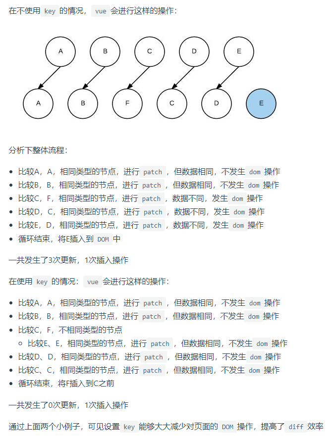

# 每日问题

## 谈谈你对vue的理解

### 1.vue是什么？

答：vue是一个js框架，是作者尤大借鉴了angular和react设计的一款mvvc数据驱动的渐进式框架。

### 2.vue核心特性：

1.mvvm数据驱动：

早期的前端使用的是mvc模式的，即m—模型层（业务逻辑和服务器端的交互逻辑），v—视图层（用户界面），c—控制层（用户交互事件）。这种传统模型的执行逻辑如下：

```
1.视图层展示UI页面给用户——>2.用户与页面交互时触发控制器（通常是一些事件）,控制器将交互指令、数据传递给模型层——>3.模型层进行逻辑判断、与数据库、服务端交互——>4.通知视图层更新
```

比较典型的代表就是早期的html、css、js开发模式，以及jquery框架，他们的特点就是直接操作dom元素实现页面的渲染。

vue框架采用了mvvm模式，即m—模型层，vm—视图模型层，v—视图层。其中模型层、视图层的作用和mvc设计模式一致，而vm层的功能正是vue，angular，react等框架所提供的——视图层和模型层通信桥梁，他们的核心在于数据绑定机制，将模型层中数据绑定到视图中，实现数据的实时更新与同步。

2.组件化

传统的开发中，一个页面的视图、样式、逻辑分别拆分到html, css, js文件中，实际开发中可能会导致耦合度高和阅读困难（得在不同的文件中跳转）。vue框架支持.vue后缀的文件格式，每一个.vue文件内都整合了html模板, css样式以及js逻辑，一个vue文件就是一个组件。

它的优点在于：

`1.耦合度降低，粒度更细：传统开发通常以页面为单位，vue以组件为基本单位（vue3中甚至以函数为基本单位）；`

`2.维护性更高，复用性更好：粒度更细后可以把逻辑根据耦合度进行更细的拆分，对于不同页面可以复用相同的组件。`

3.指令系统

vue在模板中设计了一套指令系统，常用命令如下：

v-bind: 数据绑定;

v-model: 双向绑定;

v-for: 列表渲染;

v-if: 条件渲染;

v-on: 绑定事件。

### 3.vue和react框架的异同？

相同点：

1.都使用了mvvm设计模式，利用数据驱动视图而非直接操作dom；

2.都使用了虚拟dom减少真实dom的操作；

3.都有组件化开发的思想；

4.都能够使用服务端渲染；

不同点：

1.数据流向不同：react遵循数据单向流动，而vue是双向数据流；

2.数据变化、实现原理的不同：react是不可变数据，react中的state、props的数据结构决定了一旦他们被赋值则无法去更新值，只能够通过创建一份新的state、props数据副本，并将原数据的引用指向新的数据副本，vue中的数据则是可以被修改而无需改变引用的。

3.组件间通信方式的不同：vue中组件间的通信可以通过回调函数和事件的方式，而react中只能以回调函数的方式实现组件通信。

4.diff算法不同：react中是通过diff队列保存需要更新的DOM，得到patch树再批量更新DOM。vue则是使用双指针，边对比边更新DOM。

## 说说我对spa应用的理解？

### 1.spa的定义：

spa—single-page application，即单页面应用。早期的web应用通常是多页面应用（mpa），一个html文档对应一个页面，用户点击跳转、打开新html页面，html, css, js都要重新加载。这种交互方式体验不好。spa则始终使用同一个html文档（vue脚手架中出口文档index.html），页面跳转是通过重写页面（搭配ajax）实现用户交互，这种交互方式体验更好。（粗略、不太恰当的比方：mpa就相当于买罐装饮料，喝一瓶就得买一瓶新的；spa就相当于买一个杯子装饮料，喝了当前的再添新的）

### 2.单页面应用和多页面应用的区别：

|                 | SPA                              | MPA                                              |
| --------------- | -------------------------------- | ------------------------------------------------ |
| 组成            | 一个主页面和多个页面片段         | 多个主页面                                       |
| 刷新方式        | 局部刷新                         | 整页刷新                                         |
| url模式         | 哈希模式                         | 历史模式                                         |
| seo搜索引擎优化 | 难实现，可以用SSR改善            | 容易实现                                         |
| 数据传输        | MPA的方式+框架自带的数据传递方式 | 只能用query, cookie, localStorage, indexedDb传递 |
| 页面切换        | 加载更快，体验好                 | 加载慢，体验较差                                 |
| 维护成本        | 相对低                           | 相对高                                           |

从上面就可以看出SPA的优缺点了：

优点：

1.用户体验好；

2.搭配框架使用可维护性更好；

缺点：

1.SPA首次加载慢；

[为什么SPA会出现首屏加载慢的问题？](#jump1)

2.SEO优化难做；

### 3.给SPA做SEO

1.SSR服务端渲染；

2.使用phantomjs做爬虫处理。

## <span id='jump1'>SPA首屏加载速度慢解决方案</span>

### 1.什么是首屏加载：

答：首屏加载是指用户打开浏览器页面直到屏幕显示出内容的这一过程。通常用首屏加载时间衡量用户体验，首屏加载时间越短，用户体验越好。计算首屏加载时间的方式：

```js
// 1.利用DOMContentLoaded事件
document.addEventListener('DOMContentLoaded', (event) => {
    console.log('first contentful painting');
});

// 2.利用performance
performance.getEntriesByName("first-contentful-paint")[0].startTime

// performance.getEntriesByName("first-contentful-paint")[0]
// 会返回一个 PerformancePaintTiming的实例，结构如下：
{
  name: "first-contentful-paint",
  entryType: "paint",
  startTime: 507.80000002123415,
  duration: 0,
};
```

### 2.首屏加载慢的原因？

答：1.资源体积太大；2.网络原因，服务器带宽太小；3.加载脚本的时候，渲染内容被阻塞；4.资源重复加载。

### 3.解决方案？

通过两个方面去解决：页面渲染优化 和 资源加载优化。

资源加载优化本质上就是包体积过大，思路也可以有两种方式：整体包体积的减小，单次请求体积的减小。可以使用下面的方法去减少、拆分包体积：

1.大包拆分成小包：比如一个冗余的大项目包可以根据模块拆分细化成一个个小包，比如我的上家公司就是开发isales+的客户CRM销售平台。原来的项目非常大，打包后体积十几m，首次加载时间非常长，后来实行模块化拆分，比如搜索模块单独拆分，根据客户销售模块拆分出四大实体（合同、标书、PO等）、积分功能拆分出打法库、成就中心、根据用户反馈拆分的社区模块等待。

2.路由懒加载：使用了es6的import()异步加载的方式实现路由懒加载，本质上就是利用webpack的code splitting，会把整个完整的js文件根据路由拆分出多个js文件，从而减小文件单次请求体积。

3.静态资源的本地缓存：

对于前端，合理利用localStorage、sessionStorage和indexedDB；

对于后端，可以有下面的方法：

|          | http缓存                                                     | service worker离线缓存 |
| -------- | ------------------------------------------------------------ | ---------------------- |
| 缓存种类 | 强制缓存：由Cache-Control和Expires字段控制，对于Cache-Control，no-cache表示不缓存，max-age表示缓存时间，单位为秒；对于Expires指定一个缓存过期时间，值要为GMT格式的日期字符串。<br />协商缓存：通过设置http响应头中的Etag和Last-Modified字段实现。Etag是一段hash值，表示资源内容状态，Last-Modified表示资源最后修改时间。当这两个字段没有变化，服务器返回304表示浏览器可以复用缓存数据。 | 利用API实现本地缓存    |

4.UI框架按需引入而不是全部引入

5.图片压缩：可以使用图片压缩工具压缩png，jpg图片；对于小图标可以使用雪碧图or字体图标代替。

6.使用Gzip压缩：compression-webpack-plugin插件，并在vue.config.js中做出相应配置

7.SSR服务端渲染。

## 你是如何理解vue中的v-if和v-show的？

### 1.v-show和v-if的共同点？

答：两者都能够控制元素在页面的显示和隐藏，表达式为true，二者都会占据页面的位置，表达式为false时，二者都不会占据页面位置。

### 2.v-show和v-if的区别？

1.控制手段不同：

v-show是通过控制css属性中display: none/block来实现元素的隐藏/显示；v-if是通过操作DOM节点的挂载/卸载去实现元素的显示/隐藏。

2.编译过程不同：

v-show仅仅是简单的css切换，v-if切换是局部编译/卸载过程，切换过程会销毁、重建组件内部的事件监听和子组件。

v-show状态变化不会触发生命周期钩子；

v-if状态变化会触发生命周期钩子（挂载阶段：beforeCreate，created，beforeMount，mounted 卸载阶段：beforeDestroy，destroyed）

通常来说，v-show渲染消耗大，v-if切换消耗大，所以频繁切换用v-show，其余可以考虑v-if。

## 说说我对vue生命周期的理解？

### 1.生命周期的定义？

vue的生命周期指的是vue实例、vue组件从创建到销毁的全过程，创建实例——>初始化数据——>编译模板——>挂载DOM——>渲染——>更新——>重新渲染——>卸载。

### 2.生命周期有哪些？

| 生命周期      | 描述                                                         |
| ------------- | ------------------------------------------------------------ |
| beforeCreate  | 组件实例创建之前，执行时组件实例还未创建，通常用于插件开发中执行一些初始化任务 |
| created       | 组件初始化完毕，各种数据可以使用，常用于异步数据获取（完成了数据观测，此时可以获取到inject, data, props, methods, watch,provider） |
| beforeMount   | 组件挂载到实例之前，未执行渲染、更新，dom未创建              |
| mounted       | 组件挂载到实例之后，在mounted钩子函数中可以访问到DOM元素。该阶段表明了组件创建阶段结束，进入运行阶段。 |
| beforeUpdate  | 组件数据更新之前，可用于获取更新前各种状态                   |
| updated       | 组件数据更新之后，所有状态已是最新                           |
| beforeDestroy | 组件实例销毁之前，此时还能访问到组件内部属性和监听事件，可用于一些定时器或订阅的取消 |
| destroyed     | 组件实例销毁后                                               |
| activated     | keep-alive组件切换到激活状态时                               |
| deactivated   | keep-alive组件切换到非激活状态时                             |

### 3.created和mounted钩子函数的区别？

答：钩子触发先后顺序不同，created——>mounted，created在组件实例创建完成时调用，此时页面还没有生成DOM，而mounted是在页面DOM节点挂载后触发。

共同点：都能拿到实例的属性、方法；

注意：向服务器请求数据最好在created钩子中进行，因为mounted阶段页面已经渲染完成，此时获取到数据进行更新，会引发页面重渲染可能导致页面出现闪动。

## v-for和v-if的优先级

### 1.v-if和v-for的作用：

v-if：条件渲染，通过true or false判断某段代码片段是否需要进行渲染。

v-for：列表渲染，通常基于一个数组来渲染一组列表数据，通常而言需要设置key值，以便于diff算法比对优化（否则可能出现就地复用而导致ui异常的情况）。

### 2.同时使用时优先级：

```js
export function genElement (el: ASTElement, state: CodegenState): string {
  if (el.parent) {
    el.pre = el.pre || el.parent.pre
  }
  if (el.staticRoot && !el.staticProcessed) {
    return genStatic(el, state)
  } else if (el.once && !el.onceProcessed) {
    return genOnce(el, state)
    // v-for
  } else if (el.for && !el.forProcessed) {
    return genFor(el, state)
    // v-if
  } else if (el.if && !el.ifProcessed) {
    return genIf(el, state)
  } else if (el.tag === 'template' && !el.slotTarget && !state.pre) {
    return genChildren(el, state) || 'void 0'
  } else if (el.tag === 'slot') {
    return genSlot(el, state)
  } else {
    // component or element
    ...
}
```

根据源码可以看出，v-for的优先级高于v-if

### 3.注意事项

v-for和v-if避免同时使用到同一个元素中，最好的做法时v-if用template嵌套作为外层，v-for循环作为内层。

## 为什么data属性是一个函数而不是一个对象？

严格来说，vue的实例（根组件）可以是对象也可以是函数，但是vue的组件就只能是函数，否则会报错。

原因可以用原型链来解释：

```js
// 假设组件是通过构造函数生成
function Comp () {
    // ...todo
}

// 1.data属性如果是对象，相当于在构造函数原型上挂载对象
Comp.prototype.data = {
    // ...something
}

// 两个实例访问的是同一个地址值，其中一个组件改动一定会引发另一个组件发生变化
let compA = new Comp()
let compB = new Comp()

compA.data === compB.data // true


// 2.反之，data属性如果是函数，那就相当于在构造原型上挂载函数
function Comp () {
    this.data = this.data()
    // ...todo
}
Comp.prototype.data = function () {
    // ...something
    return {
        // ...something
    }
}

// 此时两个实例的data属性分别是两个不同的引用值
let compA = new Comp()
let compB = new Comp()

compA.data === compB.data // false
```

总结：

1.根组件实例data属性可以是对象也可以是函数，因为根实例是一个单例，不存在数据污染；

2.组件实例的data属性必须是函数，目的是防止多个组件实例共用一个data，产生数据污染。采用函数形式，initData时会作为工厂函数返回全新的data防止数据污染。

## 动态给vue添加新属性时会发生什么？如何解决？

当vue实例初始化后给data添加新属性不会触发页面视图的渲染。因为实例化之后添加的属性并没有被Object.defineProperty处理，也就是没有进行数据监听。

解决方案：

1.Vue.set(target, key, value)：

```js
// set的作用就是把新添加的属性进行数据观测，并通知依赖更新从而更新视图
function set (target: Array<any> | Object, key: any, val: any): any {
  ...
  defineReactive(ob.value, key, val)
  ob.dep.notify()
  return val
}

function defineReactive(obj, key, val) {
    Object.defineProperty(obj, key, {
        get() {
            console.log(`get ${key}:${val}`);
            return val
        },
        set(newVal) {
            if (newVal !== val) {
                console.log(`set ${key}:${newVal}`);
                val = newVal
            }
        }
    })
}
```

2.Object.assign

```js
// 直接将新属性添加到源对象不会触发更新
// 正确做法是将源对象和新属性混入一个新的空对象中
this.someObject = Object.assign({}, this.someObject, {newProperty}) // correct
```

3.$forceUpdate

强制组件实例重新渲染，只影响组件实例和插入插槽内容的子组件，不影响其他子组件。

总结：添加少量属性用set，添加大量属性用Object.assign，尽量避免$forceUpdate。Vue3中后续添加的新属性也是响应式的。

## Vue中组件和插件有什么区别？

### 1.组件是什么？

组件就是根据功能模块把图形、非图形的各种逻辑抽象为一个统一的概念。对于Vue，一个.vue文件就是一个组件。

组件化的好处：1.降低系统的耦合度；2.调试方便，便于后期维护。

### 2.插件是什么？

插件就是给框架提供全局功能，也就是一种功能拓展。

比如说vue-cli, vue-router, vuex等，都是给vue提供了新的API，拓展了vue的功能。

### 3.二者的区别？

1.编写形式的不同：

在vue中，编写组件通常使用.vue文件，一个.vue文件就是一个组件。

编写插件通常在一个单独的模块中暴露一个install函数，函数接受两个参数，第一个参数是vue构造器，第二个参数是选项对象。

2.注册形式的不同：

vue组件的注册一般是通过vue.component或者options选项对象中的components属性去注册全局/局部组件。

vue的插件则是在new Vue方法调用前使用use方法调用去注册，一般传两个参数，第一个是插件名，第二个是配置项，**use重复注册同一个插件只会生效一次**。

**总结：**

组件是业务模块的抽象，通常针对于项目本身。

插件是功能模块的拓展，通常是对Vue功能的补充。

## Vue组件间通信方式都有哪些？

1.父子间通信：props + $emit、 ref(不推荐，因为父组件调用子组件的数据、方法不合常理)

2.爷孙间通信：$attrs，传递的参数只要没有被中间组件用props $emit消费掉，就会透传给子组件（注意：如果子组件是多根组件，一定要显式绑定v-bind=”$attrs“）

3.祖先深层次通信：provide/inject注入，provide提供值，inject接收值

4.兄弟间通信：1.通过他们共同父级通信$parent；2.$bus总线；3.vuex/pinia插件

5.复杂通信：vuex、pinia

## 跟尤大学Vue

### 1.vue的三大模块：

vue中三大核心模块分别为响应式模块、编译器模块、渲染模块。

响应器模块：实现数据监听的核心

```js
// 假设一个产品有单价和数量，需要计算总价；当单价or数量发生变化时，如何实时更新总价格呢？
let product = {
    price: 5,
    quantity: 2,
  };
let total = 0;

// 计算总价的effect
const effect = () => {
	total = product.price * product.quantity;
};

// dep依赖表
const depsMap = new Map();
// dep依赖，收集effect
const dep = new Set();

// 收集依赖，根据key(属性值)进行追踪
function track(key) {
    let dep = depsMap.get(key);
    if (!dep) {
      depsMap.set(key, (dep = new Set()));
    }
    dep.add(effect);
}
// 触发依赖，同样以key进行触发
function trigger(key) {
    let dep = depsMap.get(key);
    if (dep) {
      dep.forEach((effect) => effect());
    }
}

// 初始化时收集依赖
track('quantity');
effect()

// 属性发生变化时
price = 10
quantity = 5

// 触发依赖
trigger('quantity')  // 触发dep依赖调用effect更新结果
total = 50
```


上面的层级关系可以简单概括如下：

targetMap存储了每个”响应式对象属性“关联的依赖；

depsMap存储了每个属性的依赖；

dep是一个effect集合的依赖，值发生变化时，effect需要重新运行。

```js
// 根据上面的targetMap依赖图，我们上面的track和trigger函数可以这样优化：
const targetMap = new WeakMap()

// target为响应式对象，key为对应的属性值
function track (target, key) {
    let depsMap = targetMap.get(target)
    // 创建一个响应式对象对应的属性依赖图
    if(!depsMap) {
        targetMap.set(target, (depsMap = new Map()))
    }
    let dep = depsMap.get(key)
    // 创建一个集合dep，收集属性所有对应的effect
    if(!dep) {
        depsMap.set(key, (dep = new Set()))
    }
    dep.add(effect)
}

function trigger(target, key) {
    let depsMap = targetMap.get(target)
    if(!depsMap) return
    let dep = depsMap.get(key)
    if(dep) {
        dep.forEach(effect => effect())
    }
}

track(product, 'quantity')
tract(product, 'price')

product.prict = 10

trigget(product, 'price')

total = 20
```

上面基本上就是vue收集依赖以及触发更新的过程，但是目前还没实现当数据变化时effect自动运行更新功能，需要我们手动trigger通知更新。


怎么做到自动更新呢？vue中是这么实现的：如果属性被访问（get），就要触发track函数去收集effect；如果属性被改变（set），就要触发trigger函数去执行effect。

解决问题的关键就在于，怎么去拦截get/set。在vue2中，使用Object.defineProperty去进行拦截get/set，在vue3中，则是使用ES6语法中的Reflect和Proxy去实现拦截get/set。 

下面是Vue3的响应式实现：

```js
// 代理对象
let product = reactive({
    price: 5,
    quantity: 2
})
// 需要实时响应更新的数据
let total = 0
// 副作用
const effect = () => {
    total = product.price * product.quantity
}

// 接受一个对象，把这个对象转换成响应式对象
function reactive(target) {
    // 拦截器
    const handler = {
        get(target, key, receiver) {
            // 访问属性的时候，就要进行依赖收集
            track(target, key)
            return Reflect.get(target, key, receiver)
        },
        set(target, key, value, receiver) {
            // 更改属性时，要判断新、旧属性值是否一致，不一致时才更新数据
            const oldValue = target[key];
            const result = Reflect.set(target, key, value, receiver);
            // 更改属性时，要判断新、旧属性值是否一致，不一致时才更新数据
            if (oldValue != value) {
              trigger(target, key);
            }
        }
    }
    // ES6对象代理
    return new Proxy(target, handler)
}

// 目标对象Map收集响应式对象对应的depsMap
const targetMap = new WeakMap()
// 收集依赖
function track(target, key) {
    let depsMap = targetMap.get(target)
    if(!depsMap) {
        targetMap.set(target, (depsMap = new Map()))
    }
    let dep = depsMap.get(key)
    if(!dep) {
        depsMap.set(key, (dep = new Set()))
    }
    dep.add(effect)
}

// 触发依赖
function trigger(target, key) {
    let depsMap = targetMap.get(target)
    if(!depsMap) return
    let dep = depsMap.get(key)
    if(dep) {
        dep.forEach(effect => effect())
    }
}

// 初始化更新
effect()
```

上述代码中，只要我们改变了product两个属性中的一个，最终值total都会发生相应的变化。

但是上述代码也存在一个问题，那就是每次我们利用xx.xx访问响应式对象中的某个属性时，都会调用track函数收集依赖，实际上我们并不需要多次调用，只需要在effect执行时调用即可。

我们可以对上面的代码做下面修改：

```js
let product = reactive({
    price: 5,
    quantity: 2
})
let salePrice = 0
let total = 0

let activeEffect = null
// 修改effect函数
function effect(eff) {
    activeEffect = eff
    activeEffect()
    activeEffect = null
}

effect(() => {
    total = product.price * product.quantity
})
effect(() => {
    salePrice = product.price * 0.9
})

function reactive(target) {
    const handler = {
        get(target, key, receiver) {
            track(target, key)
            return Reflect.get(target, key, receiver)
        },
        set(target, key, value, receiver) {
            const oldValue = target[key];
            const result = Reflect.set(target, key, value, receiver);
            if (oldValue != value) {
              trigger(target, key);
            }
        }
    }
    return new Proxy(target, handler)
}

const targetMap = new WeakMap()
function track(target, key) {
    // activeEffect就是避免访问属性时重复调用track
    if(activeEffect) {
        let depsMap = targetMap.get(target)
        if(!depsMap) {
            targetMap.set(target, (depsMap = new Map()))
        }
        let dep = depsMap.get(key)
        if(!dep) {
            depsMap.set(key, (dep = new Set()))
        }
        dep.add(activeEffect)
    }
}

function trigger(target, key) {
    let depsMap = targetMap.get(target)
    if(!depsMap) return
    let dep = depsMap.get(key)
    if(dep) {
        dep.forEach(effect => effect())
    }
}
```

上面的代码重写了effect函数，通过activeEffect来避免多次运行track重复进行依赖收集。

如果total和salePrice有所关联，上面的代码可能会出现问题：

```js
let product = reactive({price: 5, quantity: 2})
let salePrice = 0
let total = 0

effect(() => {
	total = product.price * 0.9
})

effect(() => {
	total = salePrice * product.quantity
})
// salePrice不是响应式的，当你在初始化后更改product中的值，total值不更新
// 这时候的解决思路就是，把salePrice转换成响应式属性，可以用ref
```

解决思路：

```js
let product = reactive({price: 5, quantity: 2})
let total = 0
let salePrice = ref(0)

function ref(raw) {
    const r = {
        get value() {
            // 把value属性加入依赖
            track(r, 'value')
            return raw
        },
        set value(newVal) {
            raw = newVal
            if(newVal !== raw) {
               trigger(r, 'value') 
            }
        }
    }
    return r
}

effect(() => {
	salePrice.value = product.price * 0.9
})

effect(() => {
	total = salePrice.value * product.quantity
})
```

effect函数传入一个更新函数，只有在effect函数执行时，activeEffect不为null，track执行依赖收集，其他情况下获取响应式对象属性调用getter时，activeEffect为null，track函数不进行依赖收集。

**响应式属性更新的核心在于：依赖收集与触发更新，vue3中实现他的思路在于，对需要数据监听的对象使用proxy代理，在代理中设置getter setter，在getter函数中调用track函数去创建依赖图，收集副作用，在setter函数中调用trigger去查询依赖图，触发对应副作用更新数据。**

## Vue中nextTick的理解？

### 1.nextTick是什么？

nextTick是vue提供的一个api，它接受一个回调函数作为参数，当数据变化完成DOM更新后，触发这个回调，可以在回调中获取到更新后的DOM元素。

因为事件循环机制，vue中的数据变化和视图更新是异步的。

### 2.使用场景

一般应用在修改数据后立刻获取DOM结构。

```vue
// 1.显示input框后立即获取焦点
<input id="myInput" v-if="isShow"></input>

export default {
	data: {
		isShow: false
	}
	methods: {
		showInput() {
			this.isShow = true
			this.$nextTick(() => {
				// 此时dom中可以访问到myInput元素
				document.querySelector('#myInput').focus()
			})
		}	
	}
}

// 2. 点击按钮获取元素宽度
<div id="app">
    <p ref="myWidth" v-if="showMe">{{ message }}</p>
    <button @click="getMyWidth">获取p元素宽度</button>
</div>

getMyWidth() {
    this.showMe = true;
    //this.message = this.$refs.myWidth.offsetWidth;
    //报错 TypeError: this.$refs.myWidth is undefined
    this.$nextTick(()=>{
        //dom元素更新后执行，此时能拿到p元素的属性
        this.message = this.$refs.myWidth.offsetWidth;
  })
}

// 3.swiper插件通过axios获取图片引起的滑动问题：初始化swiper组件时，可能请求数据返回后，直接调用某些滑动api会报错；调用nextTick获取到swiper最新的dom，此时调用api就不会触发一些为止的bug。
```

### 3.实现原理

1.把传给nextTick的回调函数放入到callbacks里等待执行；

2.把执行函数根据当前环境支持情况放入微任务或宏任务队列；

3.事件循环到了任务队列后，以此执行callbacks中的回调函数。

## mixin的理解

### 1.mixin是什么？

mixin，又叫混入，官方定义就是用一种灵活的方式，提高vue组件的复用性。

mixin是一个js对象，可以给vue提供对应的选项，例如: data, methods, computed, created等等

mixin可以局部混入和全局混入：

```js
// 一、局部引入
// 1.定义一个mixin对象
var myMixin = {
  created: function () {
    this.hello()
  },
  methods: {
    hello: function () {
      console.log('hello from mixin!')
    }
  }
}

// 2.组件中引入
Vue.component('componentA',{
  mixins: [myMixin]
})

// 二、全局引入
// 1.使用Vue.mixin方法
Vue.mixin({
  created: function () {
      console.log("全局混入")
    }
})
```

### 2.使用场景

多个组件中能够共用的逻辑都可以提出来作为mixin，可以看下面例子：

```js
const Modal = {
  template: '#modal',
  data() {
    return {
      isShowing: false
    }
  },
  methods: {
    toggleShow() {
      this.isShowing = !this.isShowing;
    }
  }
}

const Tooltip = {
  template: '#tooltip',
  data() {
    return {
      isShowing: false
    }
  },
  methods: {
    toggleShow() {
      this.isShowing = !this.isShowing;
    }
  }
}

// 上述Modal弹窗和ToolTip提示框都使用同样属性和方法控制显示隐藏，可以把相同逻辑提取mixin：
const toggle = {
  data() {
    return {
      isShowing: false
    }
  },
  methods: {
    toggleShow() {
      this.isShowing = !this.isShowing;
    }
  }
}

// 局部混入
const Modal = {
  template: '#modal',
  mixins: [toggle]
};
 
const Tooltip = {
  template: '#tooltip',
  mixins: [toggle]
}
```

### 3.合并策略

1.替换型：props, methods, inject, computed, 如果组件和mixin都存在这些选项，那么组件优先级高于mixin，会覆盖掉mixin的选项。

2.合并型：data，通过set方法合并和重新赋值。组件data优先级高于mixin的data

3.队列型：生命周期和watch，会先执行mixin中的钩子，再执行组件中的钩子。

4.叠加型：component、directives、filters，通过原型链层层叠加。

## 对slot插槽的理解？

### 1.slot是什么

在vue中，slot又叫插槽，通常作为一个占位符，当父组件引用带有插槽的子组件时，子组件标签内的内容会替换掉子组件占位符，作为承载分发内容的出口。

### 2.使用场景

复用组件+组件定制化处理时使用。

当一个组件在多个地方被复用，且在不同的地方有少许的区别，这时候如果在不同地方重写组件，浪费时间和效率，这个时候就可以使用插槽。

### 3.分类

1.默认插槽；

```vue
// child.vue
<template>
	<slot>
        <p>默认展示内容</p>
    </slot>
</template>

// parent.vue
<template>
	<child>
        <div>插入插槽内容</div>
    </child>
</template>

// 注意：如果parent中的child标签不插入内容，那么展示子组件slot内默认内容
```

2.具名插槽；

```vue
// child.vue
<template>
    <slot>插槽后备的内容</slot>
    <slot name="content">插槽后备的内容</slot>
</template>

// parent.vue
<child>
    // 如果不写名字默认使用默认插槽
    <template v-slot:default>具名插槽</template>
    <!-- 具名插槽⽤插槽名做参数 -->
    <template v-slot:content>内容...</template>
</child>
```

3.作用域插槽，子组件在作用域上绑定的属性可以向外暴露给父组件。

```vue
// child.vue
<template> 
  <slot name="footer" testProps="子组件的值">
          <h3>没传footer插槽</h3>
  </slot>
</template>

// parent.vue
<child> 
    <!-- 把v-slot的值指定为作⽤域上下⽂对象 -->
    <template v-slot:default="slotProps">
      来⾃⼦组件数据：{{slotProps.testProps}}
    </template>
    <template #default="slotProps">
      来⾃⼦组件数据：{{slotProps.testProps}}
    </template>
</child>
```

### 4.注意事项

1.v-slot:slotName 可以缩写为#slotName；

2.v-slot属性只能设置在<template>标签中，默认插槽可以设置在组件标签；

3.默认插槽名可以省略不写；

4.作用域插槽的可以使用es6解构，重命名，默认值。

```js
// 解构出user变量
v-slot:slotName={ user }

// 重命名
v-slot:slotName={ user: otherName }

// 默认值
v-slot:slotName={ user = defaultName }
```


## vue的渲染流程

template ——> render function ——> VNode ——> DOM

## 你对vue中key的理解？

### 1.key是什么？

key是vue用来给vnode进行标识的id，用来优化diff算法，根据key可以更好的找到对应的vnode节点。

一般key搭配v-for使用：

1.如果不用key，vue采用就地复用，即最小化元素移动；

2.如果使用key，vue根据keys顺序记录元素，当拥有key的元素不再出现，则卸载DOM。

3.可以给key做时间戳处理，相当于手动强制渲染 (每次更新key的值都发生了改变)

```html
<Comp :key="+new Date()" />
```

### 2.设置key和不设置key的区别



## 说说你对keep-alive的理解是什么？

### 1.keep-alive是什么？

keep-alive是vue内置组件，标签内包裹的组件在切换时缓存到内存中，防止重复渲染DOM。

keep-alive包裹component动态组件，会缓存不活动的组件实例，而不是销毁他们。

keep-alive接受props属性：

1.include，传入字符串或正则表达式或数组，只有名称匹配的组件会被缓存。

2.exclude，格式同上，名称匹配的组件不会被缓存。

3.max，组件实例最大缓存数量，缓存数量超过max，则从缓存对象cache中删除第一个缓存组件。

```vue
<keep-alive include="a,b">
  <component :is="view"></component>
</keep-alive>

<!-- 正则表达式 (使用 `v-bind`) -->
<keep-alive :include="/a|b/">
  <component :is="view"></component>
</keep-alive>

<!-- 数组 (使用 `v-bind`) -->
<keep-alive :include="['a', 'b']">
  <component :is="view"></component>
</keep-alive>
```

include和exclude会先匹配组件name属性，再匹配局部注册时的名称，匿名组件不能被匹配。

使用了keep-alive组件，会多出两个生命周期钩子：`activated`和`deactivated`:

首次进入组件触发的钩子:

beforeRouteEnter > beforeCreate > created > beforeMount > mounted > activated > ... > beforeRouteLeave > deactivated

再次进入组件触发钩子:

beforeRouteEnter > activated > ... > beforeRouteLeave > deactivated

### 2.使用场景

在某些场景下页面不需要重新加载时可以使用keepAlive

比如从 首页 > 列表页 > 详情页 > 返回列表页(缓存) > 返回首页(缓存) > 列表页(不需要缓存)，可以用下面结构：

```js
// router.js
{
  path: 'list',
  name: 'itemList', // 列表页
  component (resolve) {
    require(['@/pages/item/list'], resolve)
 },
 meta: {
  keepAlive: true,
  title: '列表页'
 }
}

// app.vue
<div id="app" class='wrapper'>
    <keep-alive>
        <!-- 需要缓存的视图组件 --> 
        <router-view v-if="$route.meta.keepAlive"></router-view>
     </keep-alive>
      <!-- 不需要缓存的视图组件 -->
     <router-view v-if="!$route.meta.keepAlive"></router-view>
</div>
```

当我们需要更新缓存页数据的时候，可以在beforeRouteEnter or activated钩子中执行更新页面的操作（ssr渲染不会触发activated钩子）。

## 在vue项目中配置@绝对路径

1.在vue2项目中，可以在vue.config.js中配置：

```js
// 引入node的path模块
const path = require('path')

module.exports = defineConfig({
  // 调用path中的resolve函数，函数第一个参数__dirname为当前文件所在绝对路径
  configureWebpack: {
    resolve: {
      alias: {
        '@': path.resolve(__dirname, 'src')
      }
    }
  }
})
```

2.在jsconfig.json中需要如下配置:

```js
{
    "paths": {
      "@/*": [
        "src/*"
      ]
    }
}
```

## package.json版本号详解

版本号通常按照主版本号.次版本号.修补版本号 **major.minor.patch**排序。

~前缀：最多控制前两位，patch位任意

~1.1.2 表示版本可以>=1.1.2 and < 1.2.0

~1.1 表示版本 >= 1.1.0 and < 1.2.0

~1 表示版本 >= 1.0.0 and < 2.0.0


^前缀：版本号最左边非零数字的右侧版本可以任意取

 ^1.2.0 表示版本 >=1.0.0 and < 2.0.0

^0.2.3 表示版本 >= 0.2.3 and < 0.3.0


Latest: 安装最新版本


x，占位符，所占位版本任意：

1.2.x表示版本 >= 1.2.0 and < 1.3.0


*,表示任意版本


version1 - version2，版本介于二者之间

1.1.2 - 1.3.1 等价于 >=1.1.2 and <=1.3.1


range1 || range2, 满足指定范围

例如：< 1.0.0 || >= 2.3.1


## Vue常用的修饰符

vue常用的修饰符可以划分成以下几类：

1.表单修饰符，通常搭配input标签和v-model指令一起使用：

lazy: input输入的数据不会实时更新值，只有当光标离开标签后才更新值，等价于onChange事件。

trim: 清除首尾空格，不清除值中间的空格。

number: 把用户输入值转成数值类型。

2.事件修饰符

stop: 阻止冒泡（等价event.stopPropagation）；

prevent: 阻止标签默认事件（等价event.preventDefault）；

native: 把组件变成和html一样监听原生事件，否则组件只会监听自定义事件；

self: 只有当event.target为当前元素自身时触发；

once: 事件只触发一次；

capture: 把冒泡阶段触发事件转换成捕获阶段触发；

passive: 类似于lazy，常用于onSroll事件，减少onScroll触发频率。

> 注意：.passive不要和.prevent一起使用，否则.prevent会被忽略

3.鼠标修饰符：搭配click事件使用

left：左键触发

right：右键触发

middle：中键触发

4.键盘修饰符：搭配onKeyup、onKeydown使用

普通键：enter、tab、delete、space等

系统修饰键：ctrl、shift、alt等

keyCode (避免使用)

5.v-bind修饰符

sync：对prop进行双向绑定，相当于v-model

```vue
<comp :myProp.sync="testProp"></comp>
// 子组件中
this.$emit('update:myProp', xxx)

// 上面的用法等价于
<comp :myProp="testProp" @update:myProp="funt"></comp>
func(e) {
	this.testProp = xxx
}

// 子组件中
func2() {
	this.$emit('update:myProp', xxx)
}
```

## vue中的自定义指令

### 1.什么是指令？

vue中的指令系统是指为了数据驱动视图更方便的一套操作。

v-开头的属性都是指令。

### 2.自定义指令

自定义指令有全局和局部注册两种：

```js
// 1.全局
Vue.directive('name', {
    bind(el, binding, vnode, preVnode) {
        // ...doSomething
    }
})

// 2.局部
// 在某个.vue文件中
export default {
    data() {
        return {}
    },
    // 局部指令选项
    directives: {
        focus: {
            bind(el, binding, vnode, preVnode) {
                // ...doSomething
            }
        }
    }
}
```

自定义指令有几个钩子函数：

bind: 指令第一次绑定到元素时调用，只调用一次。

inserted：被绑定元素插入父元素时调用。

update：组件vnode更新时调用（此时子组件vnode不一定完成更新）。

componentUpdated：组件及其子组件vnode全部更新后调用。

unbind：指令和元素解绑时调用，只调一次。


vue3中钩子有所改变：

created： 绑定元素前调用。

beforeMount： 元素插入dom前调用。

mounted：绑定元素的父组件及其子节点全部挂载后调用。

beforeUpdate：绑定元素的父组件更新前调用。

updated：绑定元素父组件元素及其子元素节点都更新后调用。

beforeUnmount：绑定元素的父组件写在前调用。

unmounted：绑定元素父组件卸载后调用。


钩子接受的参数有：

el：指令绑定的元素实例

binding：绑定的对象，包括一些指令需要的属性value，arg等

vnode：绑定元素的底层vnode

prevNode：上一次渲染绑定的vnode，只在更新相关的钩子中可用

## Vue中的过滤器

### 1.是什么

vue中的过滤器类似于一个纯函数(过滤器其实就是js函数)，只是对传入的原始数据进行数据处理，返回我们所期望的数据，常用于文本格式化。（vue3中已废弃）

### 2.如何使用

```js
// 局部注册过滤器
export default {
    filters: {
        capitalize: (value) => {
            if(!value) return ''
            value = value.toString()
            return value.charAt(0).toUpperCase() + value.slice(1)
        }
    }
}

// 全局注册过滤器
Vue.filter('capitalize', function(value) {
    if(!value) return ''
    value = value.toString()
    return value.charAt(0).toUpperCase() + value.slice(1)
})
```

> 注意：如果全局过滤器和局部过滤器重名，局部过滤器优先级更高。

过滤器可以链式使用，上一个过滤的结果会作为下一个过滤器的入参：

{{ sourceData | filterA | filterB }}

过滤器可以传递参数：

{{ sourceData | filterA(arg1, arg2) }}

filterA相当于接收了三个参数，分别为: sourceData, arg1, arg2。

### 3.使用场景

过滤器通常用于单位转换，时间、文本的格式化等。

## 什么是虚拟DOM? 如何去实现虚拟DOM?

### 1.什么是虚拟DOM

虚拟DOM是一个js对象（vue中称为vnode节点），它和真实DOM的属性一一对应，是真实DOM在js语法上的映射关系。

或者说，虚拟DOM是一种抽象层的概念，它是把真实DOM抽象成独立于平台的数据结构，再根据不同平台的渲染引擎去实现虚拟DOM到真实DOM的转换。

虚拟DOM最少要包含标签名tag，属性attrs和子元素children这三个属性，不同框架命名可能不同。

> 通过对vnode抽象树进行增删改查，经过diff算法对比需要修改的最小单位，再更新视图，可以减少DOM操作，提高性能。

虚拟DOM最大的优势不仅在于通过diff算法优化了性能，而是跨平台能力。

> DOM是浏览器表示网页文档结构的对象模型。操作DOM节点的增改删查行为都会触发浏览器的重排、重绘，会导致网页性能下降。

### 2.为什么需要虚拟DOM？

DOM（文档对象模型）是浏览器中用于表示网页文档结构的对象模型。虚拟DOM最大的优势不仅在于通过diff算法优化了性能，而是跨平台能力。

> 通过对vnode抽象树进行增删改查，经过diff算法对比需要修改的最小单位，再更新视图，可以减少DOM操作，提高性能。

> DOM是浏览器表示网页文档结构的对象模型。操作DOM节点的增改删查行为都会触发浏览器的重排、重绘，会导致网页性能下降。

## 关于vue的diff算法（看不懂）

### 1.diff算法是什么？

diff算法是vue用来比对新老vnode同层树节点比较的算法。

特点：深度优先，同层比较

1.同层级比较；

2.循环从两边向中间比较。

有点类似于动态规划中查找两个字符串队列中最长公共子序列。

### 2.比较方式


## Vue中axios的封装

### 1.axios是什么？

axios是一个基于XMLHttpRequest的轻量http客户端。

特点：

1.支持在浏览器端，node端发送http请求；

2.支持Promise API；

3.基于XMLHttpRequest；

4.能够拦截请求、响应以及取消请求；

5.自动转换json数据；

6.xsrf攻击防御。

### 2.axios如何封装

```js
// 这里只大致提供下思路，不提供具体代码实现
1.引入axios包；
2.利用axios.create(option)创建axios实例，并配置好超时时间，baseUrl等属性;
3.调用axios实例的interceptors.request和interceptors.response方法，可以在每个请求前添加token或自定义属性，在每个响应后对数据做处理;
4.封装httpGet，httpPost方法，返回一个promise;
5.向外暴露get，post方法，提供给对应的api模块使用；
6.组件中引入对应的模块，并利用.then获取数据。
```

> 如果服务端提供的接口不支持跨域，有两种方法解决：
>
> 1.本地调试可以使用vue-cli提供的devServer配置代理；
>
> 2.生产部署时可以使用nginx配置代理。

## 项目中如何保证代码风格的统一性？

多人协作开发中，为了保证代码风格一致性，通常在项目中引入eslint和prettier工具搭配使用。

eslint：静态代码分析工具，根据配置规则可以在代码编写时提示代码中语法、逻辑、代码风格等错误；

prettier：代码格式化工具，根据配置规则格式化代码。

## 项目中代码提交规范如何保证？

使用commitizicen提供代码提交规范；

使用husky保证提交前检验代码，确认代码满足eslint规则。

## vue项目目录结构以及大型项目划分结构和组件的方式？

一般来说新建一个vue项目通常有下面几个步骤：

### 1.初始化项目

1.选一个包管理工具：pnpm > yarn > npm;

2.脚手架选型（vue2的vue-cli，vue3的vite）去初始化项目，这里拿vite举例：

> pnpm create vite [projectName] --template [vue or vue-ts]

3.自定义配置：

如果是ts项目，需要安装pnpm i @types/node --save-dev，修改ts.config.json:

```json
{
  "compilerOptions": {
    "typeRoots": [
      "node_modules/@types", // 默认值
      "src/types"
   ],
    "target": "esnext",
    "useDefineForClassFields": true,
    "module": "esnext",
    "moduleResolution": "node",
    "strict": true,
    "jsx": "preserve",
    "sourceMap": true,
    "resolveJsonModule": true,
    "esModuleInterop": true,
    "lib": ["esnext", "dom"],
    "baseUrl": "./",
    "paths":{        // 路径别名
      "@": ["src"],
      "@/*": ["src/*"],
    }
  },
  "include": ["src/**/*.ts", "src/**/*.d.ts", "src/**/*.tsx", "src/**/*.vue"]
}
```

修改vite.config.ts:

```typescript
import { defineConfig } from 'vite';
import vue from '@vitejs/plugin-vue';
import * as path from 'path';

// https://vitejs.dev/config/
export default defineConfig({
    resolve: {
        //设置别名
        alias: {
            '@': path.resolve(__dirname, 'src')
        }
    },
    plugins: [vue()],
    server: {
        port: 8080, //启动端口
        hmr: {
            host: '127.0.0.1',
            port: 8080
        },
        // 设置 https 代理
        proxy: {
            '/api': {
                target: 'your https address',
                changeOrigin: true,
                rewrite: (path: string) => path.replace(/^\/api/, '')
            }
        }
    }
});
```

### 2.代码风格的统一：

#### 配置eslint

1.安装eslint

> pnpm i eslint eslint-plugin-vue --save-dev

2.ts项目中eslint没法识别一些ts语法，需要安装[`@typescript-eslint/parser`](https://link.juejin.cn/?target=https%3A%2F%2Fgithub.com%2Ftypescript-eslint%2Ftypescript-eslint%2Ftree%2Fmaster%2Fpackages%2Fparser) 替代默认解析器

> pnpm install @typescript-eslint/parser --save-dev

另外安装对应的插件 [@typescript-eslint/eslint-plugin](https://link.juejin.cn/?target=https%3A%2F%2Fgithub.com%2Ftypescript-eslint%2Ftypescript-eslint%2Ftree%2Fmaster%2Fpackages%2Feslint-plugin) 它作为 eslint 默认规则的补充，提供了一些额外的适用于 ts 语法的规则。

> pnpm install @typescript-eslint/eslint-plugin --save-dev

3.eslint配置文件：

新建.eslintrc.js或者.eslintrc.json配置eslint规则：

```js
module.exports = {
    parser: 'vue-eslint-parser',

    parserOptions: {
        parser: '@typescript-eslint/parser',
        ecmaVersion: 2020,
        sourceType: 'module',
        ecmaFeatures: {
            jsx: true
        }
    },

    extends: [
        'plugin:vue/vue3-recommended',
        'plugin:@typescript-eslint/recommended',
    ],

    rules: {
        // override/add rules settings here, such as:
    }
};
```

新建.eslintignore文件，他的作用和gitignore类似，在文件中定义的类型都不会进行代码检查：

```js
// 这些文件夹、文件内的代码不会被eslint检查
node_modules/
dist/
index.html
```

4.修改package.json，配置eslint检查命令：

```json
{
    ...
    "scripts": {
        ...
        "eslint:comment": "使用 ESLint 检查并自动修复 src 目录下所有扩展名为 .js 和 .vue 的文件",
        "eslint": "eslint --ext .js,.vue --ignore-path .gitignore --fix src",
    }
    ...
}
```

#### 配置prettier

prettier是代码格式化工具，通常和eslint代码检查工具配套使用。

1.安装：

> pnpm i prettier eslint-config-prettier eslint-plugin-prettier --save-dev

2.创建.prettierrc.js or .prettier.config.js文件：

```js
module.exports = {
    // 一行最多 80 字符
    printWidth: 80,
    // 使用 4 个空格缩进
    tabWidth: 4,
    // 不使用 tab 缩进，而使用空格
    useTabs: false,
    // 行尾需要有分号
    semi: true,
    // 使用单引号代替双引号
    singleQuote: true,
    // 对象的 key 仅在必要时用引号
    quoteProps: 'as-needed',
    // jsx 不使用单引号，而使用双引号
    jsxSingleQuote: false,
    // 末尾使用逗号
    trailingComma: 'all',
    // 大括号内的首尾需要空格 { foo: bar }
    bracketSpacing: true,
    // jsx 标签的反尖括号需要换行
    jsxBracketSameLine: false,
    // 箭头函数，只有一个参数的时候，也需要括号
    arrowParens: 'always',
    // 每个文件格式化的范围是文件的全部内容
    rangeStart: 0,
    rangeEnd: Infinity,
    // 不需要写文件开头的 @prettier
    requirePragma: false,
    // 不需要自动在文件开头插入 @prettier
    insertPragma: false,
    // 使用默认的折行标准
    proseWrap: 'preserve',
    // 根据显示样式决定 html 要不要折行
    htmlWhitespaceSensitivity: 'css',
    // 换行符使用 lf
    endOfLine: 'auto'
}
```

3.给.eslintrc.js增加/修改配置

```js
module.exports = {
    ...

    extends: [
        'plugin:vue/vue3-recommended',
        'plugin:@typescript-eslint/recommended',
        'prettier',
        'plugin:prettier/recommended'
    ],

    ...
};
```

4.给package.json添加脚本配置

```json
{
    ...
    "scripts": {
        ...
        "prettier:comment": "自动格式化当前目录下的所有文件",
        "prettier": "prettier --write"
    }
    ...
}

// 运行
pnpm prettier --write .  // 会自动格式化所有文件
```

### 3.配置Store

通常为了给组件间通信，我们会给项目配置一个全局共享的仓库，一般使用vuex，pinia插件去实现，这里使用pinia：

> pinia的优点：
>
> 1.支持ts；
>
> 2.操作简单，只有state，actions，getter；
>
> 3.actions支持同步、异步；
>
> 4.无嵌套，只有store的概念，可以很好搭配useHook风格；

1.安装：

>  pnpm **i** pinia --save

2.使用：

新建一个store文件夹，并在文件夹内新建index.ts

```typescript
// 下面代码相当于调用pinia工厂函数创建了一个pinia实例，并暴露这个实例
import { createPinia } from 'pinia';

const store = createPinia();

export default store;
```

在vue注册pinia

```typescript
// main.ts

// pinia实例
import store from './store';

// 创建vue实例
const app = createApp(App)

// 挂载pinia
app.use(store)

// 挂载实例
app.mount('#app');
```

新建一个user.ts，用来存放用户数据

```typescript
// defineStore用来创建Store实例
import { defineStore } from 'pinia';

// 创建一个userStore实例存放用户信息
export const useUserStore = defineStore({
    id: 'user',
    state: () => {
        return {
            name: '张三',
        };
    },
    actions: {
        updateName(name: string) {
            this.name = name;
        },
    },
});
```

某个组件中需要使用pinia

```vue
 <template>
   <div>{{ userStore.name }}</div>
 </template>

 <script lang="ts" setup>
 import { useUserStore } from '@/store/user'
 // 获取到userStore
 const userStore = useUserStore()
 // 调用actions去修改state状态
 userStore.updateName('李四')
 </script>

```

### 4.配置router

一个spa应用由许多组件构成，通过url的变化切换组件展示就得用到vue-router。

1.安装：

>  pnpm i vue-router --save

2.使用：

新建router文件夹，并创建index.ts文件

```typescript
import { createRouter, createWebHashHistory, RouteRecordRaw } from 'vue-router';

// 创建路由表
const routes: Array<RouteRecordRaw> = [
    {
        path: '/login',
        name: 'Login',
        meta: {
            title: '登录',
            keepAlive: true,
            requireAuth: false,
        },
        component: () => import('@/views/SaleLogin.vue'),
    },
    {
        path: '/',
        name: 'Index',
        meta: {
            title: '首页',
            keepAlive: true,
            requireAuth: true,
        },
        component: () => import('@/views/HomePage.vue'),
    },
];

// 路由器实例
const router = createRouter({
    // hash模式 or history模式，这里使用了hash模式
    history: createWebHashHistory(),
    routes,
});

export default router;
```

在main.ts中注册该路由器

```typescript
 import { createApp } from 'vue'
 import App from './App.vue'
 import router from '@/router';

 // 创建vue实例
 const app = createApp(App);

 app.use(router);

 // 挂载实例
 app.mount('#app');
```

添加路由视图出口

```html
// App.vue
<template>
   <RouterView/>
</template>
```

### 5.配置css

css预编译器可以选择sass, less, stylus等

```shell
 # .scss and .sass
 pnpm add -D sass

 # .less
 pnpm add -D less
```

### 6.配置axios

单页面应用通常是一个主html + 请求数据局部刷新页面，所以需要用到请求库。

安装：

> pnpm i axios

在api文件夹下创建axios文件：

```typescript
// 第一层封装，把封装好的axios实例往外暴露

import axios, { InternalAxiosRequestConfig, AxiosResponse } from 'axios';

// axios实例
const service = axios.create();

// 请求拦截器
service.interceptors.request.use(
    (config: InternalAxiosRequestConfig) => {
        return config;
    },
    (err: unknown) => {
        Promise.reject(err);
    },
);

// 响应拦截器
service.interceptors.response.use(
    (response: AxiosResponse) => {
        return Promise.resolve(response.data);
    },
    (err: unknown) => {
        return Promise.reject(err);
    },
);

export default service;
```

在api文件夹下创建index.ts文件：

```typescript
// 第二层封装，基于axios实例封装的get、post请求

import request from './axios';

export function get(url: string, query: object) {
    return new Promise((resolve, reject) => {
        request({
            method: 'get',
            url,
            timeout: 10000,
            params: query,
        })
            .then((res) => {
                resolve(res.data);
            })
            .catch((err) => {
                reject(err);
            });
    });
}

export function post(url: string, params: object) {
    return new Promise((resolve, reject) => {
        request({
            method: 'post',
            url,
            timeout: 10000,
            data: params,
        })
            .then((res) => {
                resolve(res.data);
            })
            .catch((err) => {
                reject(err);
            });
    });
}
```

api文件夹下创建对应的业务模块：

```typescript
// 第三层封装，把业务服务向外暴露

import { get, post } from '@/api/index';

export const login = (username: string, password: string) => {
    return get('/api/auth/login', {
        username,
        password,
    });
};
```

### 7.配置UI库

一般来说PC端的UI选型通常用element-plus、antv，移动端的选型有：vant、mint-ui、cube-ui等。

### 8.配置git提交规范

为了使团队多人协作更加的规范，所以需要每次在 git 提交的时候，做一次硬性规范提交，规范 git 的提交信息。

#### commitizen (交互式提交 + 自定义提示文案 + Commit规范)

commitizen规范化提交信息。

安装commitizen

```shell
pnpm install -D commitizen cz-conventional-changelog @commitlint/config-conventional @commitlint/cli commitlint-config-cz cz-customizable
```

配置package.json

```json
{
  ...
  "scripts": {
    "commit:comment": "引导设置规范化的提交信息",
    "commit":"git-cz",
  },

  "config": {
      "commitizen": {
        "path": "node_modules/cz-customizable"
      }
  },
  ...
}
```

配置commitlint.config.js

```js
module.exports = {
    extends: ['@commitlint/config-conventional', 'cz'],
    rules: {
        'type-enum': [
            2,
            'always',
            [
                'feature', // 新功能（feature）
                'bug', // 此项特别针对bug号，用于向测试反馈bug列表的bug修改情况
                'fix', // 修补bug
                'ui', // 更新 ui
                'docs', // 文档（documentation）
                'style', // 格式（不影响代码运行的变动）
                'perf', // 性能优化
                'release', // 发布
                'deploy', // 部署
                'refactor', // 重构（即不是新增功能，也不是修改bug的代码变动）
                'test', // 增加测试
                'chore', // 构建过程或辅助工具的变动
                'revert', // feat(pencil): add ‘graphiteWidth’ option (撤销之前的commit)
                'merge', // 合并分支， 例如： merge（前端页面）： feature-xxxx修改线程地址
                'build', // 打包
            ],
        ],
        // <type> 格式 小写
        'type-case': [2, 'always', 'lower-case'],
        // <type> 不能为空
        'type-empty': [2, 'never'],
        // <scope> 范围不能为空
        'scope-empty': [2, 'never'],
        // <scope> 范围格式
        'scope-case': [0],
        // <subject> 主要 message 不能为空
        'subject-empty': [2, 'never'],
        // <subject> 以什么为结束标志，禁用
        'subject-full-stop': [0, 'never'],
        // <subject> 格式，禁用
        'subject-case': [0, 'never'],
        // <body> 以空行开头
        'body-leading-blank': [1, 'always'],
        'header-max-length': [0, 'always', 72],
    },
};

```

配置自定义提示 `.cz-config.js`

```js
module.exports = {
    types: [
        {value: 'feature',  name: 'feature:  增加新功能'},
        {value: 'bug',      name: 'bug:      测试反馈bug列表中的bug号'},
        {value: 'fix',      name: 'fix:      修复bug'},
        {value: 'ui',       name: 'ui:       更新UI'},
        {value: 'docs',     name: 'docs:     文档变更'},
        {value: 'style',    name: 'style:    代码格式(不影响代码运行的变动)'},
        {value: 'perf',     name: 'perf:     性能优化'},
        {value: 'refactor', name: 'refactor: 重构(既不是增加feature，也不是修复bug)'},
		{value: 'release',  name: 'release:  发布'},
		{value: 'deploy',   name: 'deploy:   部署'},
        {value: 'test',     name: 'test:     增加测试'},
        {value: 'chore',    name: 'chore:    构建过程或辅助工具的变动(更改配置文件)'},
        {value: 'revert',   name: 'revert:   回退'},
    	{value: 'build',    name: 'build:    打包'}
    ],
    // override the messages, defaults are as follows
    messages: {
        type: '请选择提交类型:',
        customScope: '请输入您修改的范围(可选):',
        subject: '请简要描述提交 message (必填):',
        body: '请输入详细描述(可选，待优化去除，跳过即可):',
        footer: '请输入要关闭的issue(待优化去除，跳过即可):',
        confirmCommit: '确认使用以上信息提交？(y/n/e/h)'
    },
    allowCustomScopes: true,
    skipQuestions: ['body', 'footer'],
    subjectLimit: 72
};
```

#### husky：提交commit前的代码检查

安装：

```shell
# 1.安装
pnpm i husky lint-staged -D

# 2.生成 .husky 的文件夹
npx husky install

# 3.添加 hooks，会在 .husky 目录下生成一个 pre-commit 脚本文件
npx husky add .husky/pre-commit "npx --no-install lint-staged"

# 4.添加 commit-msg
npx husky add .husky/commit-msg 'npx --no-install commitlint --edit "$1"'

# 5. 使用 `git commit -m "message"` 就会看到 hook 生效了。
```

添加package.json配置：

```json
{
  ...
  "lint-staged": {
    	"*.{js,ts}": [
            "npm run eslint",
            "npm run prettier"
    	]
  }
  ...
}
```

### 9.提交日志

- [standard-version](https://link.juejin.cn/?target=https%3A%2F%2Fgithub.com%2Fconventional-changelog%2Fstandard-version) 或者 [conventional-changelog](https://link.juejin.cn/?target=https%3A%2F%2Fgithub.com%2Fconventional-changelog%2Fconventional-changelog)

### 10.项目划分规范：

1.保证文件夹和文件夹内部文件语义一致性；

2.单一入口/出口;

3.耦合紧密的文件采用相对路径，公共文件采用绝对路径；

4./src外的文件一般不能引入。

## Vue项目的权限管理

权限就是对特定资源的访问许可，权限控制就是确保用户能够访问被分配的资源。

前端权限控制一般有四种：

### 1.接口权限；

接口权限通过jwt形式来完成。前后端配合来完成。前端调用登录服务，提供账户、密码给后端，后端生成token令牌返回给前端，前端把token存储到cookie or localStorage中，之后在axios的请求拦截器中携带该token，根据服务器返回的状态码判断权限（通常是401）。

### 2.按钮权限；

方案1：获取到用户角色列表roles后，前端用v-if手动判断。

方案2：写一个vue指令。

### 3.菜单权限；

可以理解为菜单和路由解耦。

方案1：菜单和路由分离，菜单由后端提供

前端提供路由信息：

```js
{
    name: "login",
    path: "/login",
    component: () => import("@/pages/Login.vue")
}
```

核心在于利用name属性和后端返回的菜单做关联，后端返回的菜单必须要有name对应的字段，并且具有唯一性。

方案2：路由和菜单都由后端返回

前端只定义组件

```js
const Home = () => import("../pages/Home.vue");
const UserInfo = () => import("../pages/UserInfo.vue");
export default {
    home: Home,
    userInfo: UserInfo
};
```

后端返回组件列表

```js
[
    {
        name: "home",
        path: "/",
        component: "home"
    },
    {
        name: "home",
        path: "/userinfo",
        component: "userInfo"
    }
]
```

把组件列表中的component处理后转换成前端真正的组件。

这两种方案的缺点：

1.配置麻烦，前后端配合要求过高。

### 4.路由权限；

方案1：前端挂载所有路由，给每个路由加上meta元信息判断权限，在每次路由跳转前做校验：

```typescript
import { createRouter, createWebHashHistory, RouteRecordRaw } from 'vue-router';
import { useUserStore } from '@/store/user';

// 挂载路由
const routes: Array<RouteRecordRaw> = [
    {
        path: '/login',
        name: 'Login',
        meta: {
            title: '登录',
            keepAlive: true,
            requireAuth: false,
        },
        component: () => import('@/views/SaleLogin.vue'),
    },
    {
        path: '/',
        name: 'Index',
        meta: {
            title: '首页',
            keepAlive: true,
            requireAuth: true,
        },
        component: () => import('@/views/HomePage.vue'),
    },
    {
        path: '/permission',
        name: 'Permission',
        meta: {
            title: '权限页',
            keepAlive: true,
            requireAuth: true,
            permissionRoles: ['admin', 'test1', 'test2'],
        },
        component: () => import('@/views/SalePermission.vue'),
    },
    {
        path: '/404',
        name: 'NotFound',
        meta: {
            title: '404无权限',
            keepAlive: true,
            requireAuth: false,
        },
        component: () => import('@/views/SaleNotFound.vue'),
    },
];

// 路由权限判断
function hasPermission(roles: string[], permissionRoles: string[]) {
    if (roles.includes('admin')) return true;
    if (!permissionRoles) return true;
    return roles.some((role) => permissionRoles.includes(role));
}

const router = createRouter({
    history: createWebHashHistory(),
    routes,
});

// 前置路由守卫
router.beforeEach(async (to, from, next) => {
    // 获取user仓库数据
    const userStore = useUserStore();
    // 判断当前跳转的路由是否需要权限
    if (to.meta.requireAuth) {
        debugger;
        // 用户数据仓库还没有获取到角色信息
        if (userStore.roles.length === 0) {
            // 获取角色信息
            await userStore.getRoles('admin', '123456');
            // 重定向跳转，会重新执行一次前置路由守卫
            next({ ...to, replace: true });
        } else {
            // 判断当前角色能否进入改路由
            if (
                hasPermission(
                    userStore.roles,
                    to.meta.permissionRoles as string[],
                )
            ) {
                // 有权限，放行
                next();
            } else {
                // 没权限，定向到404页
                next({ path: '/404', replace: true });
            }
        }
    } else {
        // 不需要做权限判断的路由
        next();
    }
});

export default router;
```

这种方案的缺点：

1.全局路由守卫每次路由跳转都要判断；

2.菜单信息写死在了前端，每次修改都要重新编译；

3.菜单和路由信息高耦合。

方案二：初始化阶段先挂载无权限路由（登录页，404页），如果用户通过url跳转其他路由，直接重定向到404。登陆后，获取用户权限信息，筛选有权限访问的路由，再通过全局路由守卫调用addRoutes添加路由。

````mermaid
graph TD;
		url变化,触发router.beforeEach路由守卫 --> 是否有Token?
		是否有Token? --有token--> 路由是否跳转到/login? --是--> 重定向到首页
		路由是否跳转到/login? --否--> 在Store中查找当前登录用户角色信息
		在Store中查找当前登录用户角色信息 --无roles--> 调相关服务获取roles
		调相关服务获取roles --根据roles权限生成可访问的路由表--> 调用router.addRoutes动态添加路由表 --> A["调用hack方法next({...to, replace: true})"]
		调相关服务获取roles --服务报错-----> 清除token,要求重新登陆并重定向到首页
		在Store中查找当前登录用户角色信息 --有roles--> 用当前用户的roles和路由to.meta.permissionRoles对比判断是否有权限 --无权限--> 跳转到无权限路由页 
		用当前用户的roles和路由to.meta.permissionRoles对比判断是否有权限 --有权限--> 跳转到指定路由
		是否有Token? --没token--> 路由跳转路径在路由表白名单中? --是--> 跳转到指定路由
		路由跳转路径在路由表白名单中? --否--> 重定向到登录页
````

`next({ ...to, replace: true })`的作用是在路由导航过程中替换当前的历史记录而不是添加一个新的历史记录。这意味着，当用户使用浏览器的后退按钮时，不会回到被替换的路由记录，而是直接跳过它。这在某些情况下可以用于实现特定的路由控制逻辑，例如在登录页面成功后直接跳转到主页，而不会留下登录页面的历史记录。

上面的思维导图转换成代码后如下：

```typescript
import router from './router'
import store from './store'
import { Message } from 'element-ui'
import NProgress from 'nprogress' // progress bar
import 'nprogress/nprogress.css'// progress bar style
import { getToken } from '@/utils/auth' // getToken from cookie

NProgress.configure({ showSpinner: false })// NProgress Configuration

// permission judge function
function hasPermission(roles, permissionRoles) {
  if (roles.indexOf('admin') >= 0) return true // admin permission passed directly
  if (!permissionRoles) return true
  return roles.some(role => permissionRoles.indexOf(role) >= 0)
}

const whiteList = ['/login', '/authredirect']// no redirect whitelist

router.beforeEach((to, from, next) => {
  NProgress.start() // start progress bar
  if (getToken()) { // determine if there has token
    /* has token*/
    if (to.path === '/login') {
      next({ path: '/' })
      NProgress.done() // if current page is dashboard will not trigger	afterEach hook, so manually handle it
    } else {
      if (store.getters.roles.length === 0) { // 判断当前用户是否已拉取完user_info信息
        store.dispatch('GetUserInfo').then(res => { // 拉取user_info
          const roles = res.data.roles // note: roles must be a array! such as: ['editor','develop']
          store.dispatch('GenerateRoutes', { roles }).then(() => { // 根据roles权限生成可访问的路由表
            router.addRoutes(store.getters.addRouters) // 动态添加可访问路由表
            next({ ...to, replace: true }) // hack方法 确保addRoutes已完成 ,set the replace: true so the navigation will not leave a history record
          })
        }).catch((err) => {
          store.dispatch('FedLogOut').then(() => {
            Message.error(err || 'Verification failed, please login again')
            next({ path: '/' })
          })
        })
      } else {
        // 没有动态改变权限的需求可直接next() 删除下方权限判断 ↓
        if (hasPermission(store.getters.roles, to.meta.roles)) {
          next()//
        } else {
          next({ path: '/401', replace: true, query: { noGoBack: true }})
        }
        // 可删 ↑
      }
    }
  } else {
    /* has no token*/
    if (whiteList.indexOf(to.path) !== -1) { // 在免登录白名单，直接进入
      next()
    } else {
      next('/login') // 否则全部重定向到登录页
      NProgress.done() // if current page is login will not trigger afterEach hook, so manually handle it
    }
  }
})

router.afterEach(() => {
  NProgress.done() // finish progress bar
})
```

总结：

创建vue实例的时候将vue-router挂载，但这个时候vue-router挂载一些登录或者不用权限的公用的页面。

当用户登录后，获取用role，将role和路由表每个页面的需要的权限作比较，生成最终用户可访问的路由表。

调用router.addRoutes(store.getters.addRouters)添加用户可访问的路由。

使用vuex或者pinia管理路由表，根据可访问的路由渲染侧边栏组件。

方案缺点：

1.全局路由守卫每次路由跳转都要判断；

2.路由和菜单高耦合；

3.菜单信息写死在前端。

## Vue中跨域实现

### 什么是跨域？

跨域是指在浏览器中当一个网页的脚本试图去访问另一个网站的资源时，会被浏览器所阻止。这种安全策略被称为同源策略，浏览器只允许网页脚本访问和自身处在同一源的资源。

同源指协议、域名、端口号一致，否则被视为不同源，一般在使用ajax、web socket 前端框架时会出现这种情况。

### 如何解决？

1.jsonp：

利用了script标签不受同源策略影响的原理，动态的编写script标签去请求资源；服务器端返回函数，数据就保存在这些函数的返回值中；前端挂载这些函数并调用，就可以获取到数据了。

2.跨域资源共享(cors)：

cors需要后端配置，通常需要给http请求添加响应头Access-Control-Allow-Origin: [target host]，用来控制指定源访问资源；

如果客户端的请求有自定义的头部，非简单请求(post, put, delete等)或者使用了非原始请求的Content-Type类型，浏览器会先发送一个预检请求(options)，服务器需要对请求进行处理。

预检中浏览器需要携带 Access-Control-Request-Method 头和一个 Access-Control-Request-Headers 头，那么服务器需要在响应中添加对应的头：

```
// 指定实际请求使用的方法
Access-Control-Allow-Methods: GET, POST, PUT
// 自定义头部
Access-Control-Allow-Headers: Authorization, Content-Type
```

预检成功后服务器要对实际请求进行响应，需要添加对应的头部：

```
Access-Control-Allow-Origin: https://example.com
Access-Control-Expose-Headers: Authorization
```

下面是服务端koa框架的响应头代码：

```js
app.use(async (ctx, next)=> {
  // 设置为*其实意义不大，可以说是形同虚设，实际应用中，上线前我们会将Access-Control-Allow-Origin 值设为我们目标host
  ctx.set('Access-Control-Allow-Origin', '*');
  ctx.set('Access-Control-Allow-Headers', 'Content-Type, Content-Length, Authorization, Accept, X-Requested-With , yourHeaderFeild');
  ctx.set('Access-Control-Allow-Methods', 'PUT, POST, GET, DELETE, OPTIONS');
  if (ctx.method == 'OPTIONS') {
    ctx.body = 200; 
  } else {
    await next();
  }
})
```

3.代理

前端在开发阶段，通常使用脚手架提供的配置项配置一个本地代理服务器，通过代理服务器转发请求。

下面是vue-cli中配置：

```js
module.exports = {
    devServer: {
        host: '127.0.0.1',
        port: 8084,
        open: true,// vue项目启动时自动打开浏览器
        proxy: {
            '/api': { // '/api'是代理标识，用于告诉node，url前面是/api的就是使用代理的
                target: "http://xxx.xxx.xx.xx:8080", //目标地址，一般是指后台服务器地址
                changeOrigin: true, //是否跨域
                pathRewrite: { // pathRewrite 的作用是把实际Request Url中的'/api'用""代替
                    '^/api': "" 
                }
            }
        }
    }
}
```

在axios或者fetch中配置一个根路径：

```js
axios.defaults.baseURL = '/api'
```

但是最终发布上线时如果web应用和接口服务器不在一起仍会跨域，所以上线的时候需要在服务端配置代理或者用nginx配置代理：

express框架配置代理：

```js
var express = require('express');
const proxy = require('http-proxy-middleware')
const app = express()
app.use(express.static(__dirname + '/'))
app.use('/api', proxy({ target: 'http://localhost:4000', changeOrigin: false
                      }));
module.exports = app
```

nginx配置代理：

```js
server {
    listen    80;
    # server_name www.josephxia.com;
    location / {
        root  /var/www/html;
        index  index.html index.htm;
        try_files $uri $uri/ /index.html;
    }
    location /api {
        proxy_pass  http://127.0.0.1:3000;
        proxy_redirect   off;
        proxy_set_header  Host       $host;
        proxy_set_header  X-Real-IP     $remote_addr;
        proxy_set_header  X-Forwarded-For  $proxy_add_x_forwarded_for;
    }
}
```

4.iframe

5.postMessage

## Vue项目部署到服务器后报404

### 1.如何部署vue项目

在前后端分离模式下，前端开发完成后，打包构建后的代码(npm run build)，把它上传到服务器，利用web容器启动就可以通过域名访问。

自动化、容器、镜像、流水线部署本质上都是把这一套部署逻辑抽象化、隔离化。

### 2.部署后的404问题

本地运行正常，部署到服务器后404，并且路由模式是history模式时会出现该情况。

### 3.为什么路由为history模式下会出现404问题呢？

vue框架通常是部署SPA应用，只有一个宿主html，nginx配置如下：

```js
server {
  listen  80;
  server_name  www.xxx.com;

  location / {
    index  /data/dist/index.html;
  }
}
```

当我们输入www.xxx.com，会访问dist目录下的index.html，当输入www.xxx.com/login时，location中并没有相关的配置，get请求就会返回404。

#### 4.为什么hash模式不会出现问题？

拿上面的站点举例，hash模式下url路径为www.xxx.com/#/login，hash值为#/login。此时服务器端收到的url链接为www.xxx.com，所以即使没配置login对应的location也不会报错。

hash模式的特点：url中的hash不包含在http请求中，对服务端没有影响，改变hash不会引起页面的重新渲染。

### 5.解决方案

给其他路径做重定向处理，统一重定向到index.html

```bash
server {
  listen  80;
  server_name  www.xxx.com;

  location / {
    index  /data/dist/index.html;
    // try_files的作用就是按顺序匹配多个文件或目录，并在找到第一个匹配项后返回
    // 如果找不到对应的目录，那就返回index.html作为默认文件
    try_files $uri $uri/ /index.html;
  }
}
```

配置完后重启nginx

```bash
nginx -s reload
```

> 注意：重定向之后，后端不会再报404错误，因为都重定向到了index.html中。需要前端对404页面做处理。

## 如何处理vue项目中的错误

通常来说项目中的错误分为两种：

### 1.后端接口错误

如果是响应体状态码错误（401 403 404），可以在axios的响应拦截器中做对应的处理。

```js
import axios from 'axios'
const service = axios.create()

service.interceptors.response.use(
	resp => {
        return resp
    },
    err => {
        if(err.response.status === 401/403/404) {
            // ...dosomething
        } else {
            return Promise.reject(err)
        }
    }
)
```

或者对后端返回的响应体内的body做逻辑处理，比如和后端约定好code字段，不同的code对应不同的错误逻辑处理。

### 2.代码本身逻辑问题

全局错误处理函数：

```typescript
interface AppConfig {
  errorHandler?: (
    err: unknown,
    instance: ComponentPublicInstance | null,
    // `info` 是一个 Vue 特定的错误信息
    // 例如：错误是在哪个生命周期的钩子上抛出的
    info: string
  ) => void
}

app.config.errorHandler
```

错误处理器接收三个参数：错误对象、触发该错误的组件实例和一个指出错误来源类型信息的字符串。

它可以从下面这些来源中捕获错误：

- 组件渲染器
- 事件处理器
- 生命周期钩子
- `setup()` 函数
- 侦听器
- 自定义指令钩子
- 过渡 (Transition) 钩子

生命周期钩子：

```typescript
function onErrorCaptured(callback: ErrorCapturedHook): void

type ErrorCapturedHook = (
  err: unknown,
  instance: ComponentPublicInstance | null,
  info: string
) => boolean | void
```

捕获错误来源和接收参数与全局错误处理函数一致。

> 注意：如果组件继承链上有多个onErrorCaptured，错误会向上冒泡直至顶层errorHandler函数，可以给errorCaptured中的钩子函数返回false阻止冒泡。

## vue2和vue3的区别？

从我个人的角度来说，vue2和vue3的区别有：

1.选项式api和组合式api的区别；

2.支持typescript；

3.使用proxy代理去替代了Object.defineProperty。


Vue3相比于Vue2的优化：

源码方面：1.vue3的项目采用了monorepo，根据模块的不同拆分到packages下面不同的子目录；2.采用ts编写，提供了类型检查。

性能方面：1.重写了虚拟DOM实现；2.编译模板方面优化；3.数据劫持优化。

vue2的数据劫持采用的是Object.defineProperty，这个api没法监听对象属性的添加和删除，要想初始化组件后动态增/删数据，必须采用$set/$remove方法

vue3的数据劫持采用es6中的proxy，proxy可以监听整个对象，也可以监听属性的增加/删除。proxy没法监听嵌套对象中的属性变化，vue3中的处理方式是在getter获取对象时递归响应式。

语法优化：

composition API替代了options API，更利于代码复用和ts支持。以往vue2中组件代码逻辑复用通常使用mixin，这种方式会导致命名冲突和数据来源不清晰。vue3中的组合式函数更为清晰。

## Vue3中为啥要用proxy去替代Vue2中的Object.defineProperty？

Object.defineProperty有几个问题：

1.无法监听对象属性的增加和删除；

2.数组方法无法监听，只能通过重写数组方法；

3.需要对对象每个属性都遍历监听，如果对象嵌套，需要递归深层监听，有性能问题。

proxy的优缺点：

1.可以监听对象、数组属性的变化；

2.对整个对象进行代理，而不是对象的属性，虽然对于嵌套对象访问时仍需要递归监听，但是性能比起defineProperty更高。

缺点：

1.作为es6的新特性，对老浏览器兼容性差(说的就是你IE！)

## composition API解决了options API什么痛点？

1.组件规模变大造成的高耦合、可读性差：vue2的代码通常分布在不同的选项中（data，method，computed...），如果组件规模变大，代码的可读性就很差，需要反复跳转。组合式api可以把处理同一块业务逻辑的部分集中在一起，可读性更强。

2.选项式代码复用存在的缺陷：vue2中代码复用通常使用mixin去复用某些函数逻辑，但是同一个组件引入多个mixin文件，就可能造成命名冲突或者数据来源不清晰的问题。

3.TypeScript支持受限；

4.this指向混乱的问题。

## vue3中的treeshaking特性

在vue2中，引入的Vue模块是一个单例，里面包含了各种方法，所有api都绑定在实例上。

```js
import Vue from 'vue'
```

Vue3中全局api进行分块，可以单独引用:

```js
import { nextTick, observable } from 'vue'
 
nextTick(() => {})
```

`Tree shaking`无非就是做了两件事：

- 编译阶段利用`ES6 Module`判断哪些模块已经加载
- 判断那些模块和变量未被使用或者引用，进而删除对应代码
